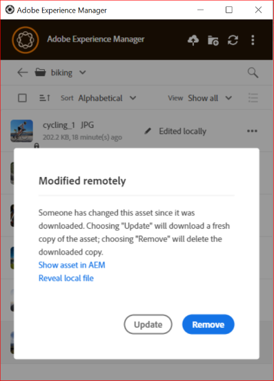

# Attività di gestione Assets in [!DNL AEM Desktop App] {#assets-management-tasks}

La gestione delle risorse prevede l’organizzazione, la manutenzione e l’ottimizzazione delle risorse digitali per semplificare i flussi di lavoro. Include attività quali la duplicazione e la ridenominazione dei file, il blocco o l’apertura di cartelle per un accesso rapido e la visualizzazione di risorse in vari layout. Ciò consente di migliorare l’efficienza, semplificare il tracciamento delle risorse e garantire un facile recupero e l’organizzazione delle risorse digitali su più piattaforme.

## Visualizzare le risorse {#view-assets}

L’app desktop AEM consente di visualizzare le risorse in quattro diverse visualizzazioni:

* **[!UICONTROL Show Assets]:** ti consente di visualizzare tutte le risorse.
* **[!UICONTROL Show Collections]:** consente di visualizzare tutte le raccolte create nell&#39;applicazione nativa AEM. Visualizza altre [raccolte](#collections-desktop-app).
* **[!UICONTROL Edited Locally]:** consente di visualizzare tutte le risorse modificate localmente. In questa vista puoi aggiungere e caricare più risorse.
* **[!UICONTROL Asset transfers]:** ti consente di visualizzare tutte le risorse trasferite dall&#39;app nativa a locale o viceversa.
* **[!UICONTROL Pinned items]:** consente di visualizzare tutti gli elementi bloccati.

Per scegliere tra varie visualizzazioni delle risorse nell’app AEM Desktop, esegui i seguenti passaggi:

1. Apri l’app desktop AEM.

1. Vai al menu a discesa Visualizza in alto a destra. Sceglietene una tra le viste disponibili.

   

## Visualizzare le cartelle e i file appena aggiunti {#view-newly-added-files-folders}

Puoi caricare le nuove risorse create dal computer locale in AEM, dove è memorizzato l’archivio centrale. Per visualizzare localmente le nuove risorse create, passa al menu a discesa **[!UICONTROL View]** e seleziona **[!UICONTROL Show Assets]** per visualizzare tutti gli aggiornamenti con la relativa timeline e i titoli, oppure seleziona **[!UICONTROL Edited Locally]**. Entrambe le opzioni mostrano esplicitamente le risorse modificate localmente.

## File duplicati {#duplicate-files}

Se si desidera conservare un file originale e apportare modifiche a un file simile, è possibile duplicare i file in posizioni diverse (locale e cloud) contemporaneamente. Può essere eseguita tramite l’operazione sui file duplicati tra le risorse.

Per duplicare i file nell’app desktop AEM, effettua le seguenti operazioni:

1. Individua una cartella e seleziona la risorsa da duplicare.

   

1. Fai clic su **[!UICONTROL More actions]**  e seleziona  **[!UICONTROL Duplicate File]** azione.

1. Il file duplicato viene creato con un nome e un contenuto identici.

## Rinominare il titolo di una risorsa o cartella {#rename-asset-title}

Per rinominare il titolo di una risorsa o cartella, effettua le seguenti operazioni:

1. Sfoglia la risorsa da rinominare. Durante la denominazione di una cartella non sono consentiti caratteri speciali come `\ / : * ?  | < > [ ] %`. Se inclusi, vengono sostituiti automaticamente con un trattino `-`.

1. Fai clic su **[!UICONTROL More actions]**  e seleziona **[!UICONTROL Rename]** per aggiungere il titolo desiderato per una risorsa.

## Aggiungi o rimuovi puntina sulla cartella {#pin-unpin-folder}

Le cartelle bloccate vengono sincronizzate automaticamente per riflettere eventuali modifiche apportate in modalità nativa all’interno dell’app. Per l’accesso rapido, puoi fissare o sbloccare una cartella eseguendo i passaggi seguenti:

1. Sfoglia la risorsa da fissare o sbloccare.

1. Fai clic su **[!UICONTROL More actions]**  e seleziona [!UICONTROL pin] per fissare la risorsa o la cartella. In alternativa, fare clic su [!UICONTROL unpin] per sbloccarlo.

   

## Aggiornamento automatico {#auto-refresh}

La funzione di aggiornamento automatico aggiorna automaticamente i contenuti in tempo reale, assicurandoti di visualizzare sempre le informazioni più recenti senza ricaricare manualmente la pagina. Esegui i passaggi seguenti per aggiornare automaticamente le risorse e ottenere l’elenco delle risorse aggiornate:

1. Apri l’app desktop AEM.

1. Fai clic sull&#39;icona  sulla barra dei menu per ottenere gli aggiornamenti.

## Raccolte {#collections-desktop-app}

L&#39;app desktop AEM ti consente di [visualizzare](#view-collections-desktop-app), [scaricare](#download-collections-desktop-app) e sfogliare le raccolte create nell&#39;applicazione [!DNL Adobe Experience Manager Assets].

### Visualizza raccolte {#view-collections-desktop-app}

Esegui la procedura seguente per visualizzare le raccolte nell’app desktop:

1. Apri l&#39;app desktop AEM e passa a [visualizza risorse](#view-assets).

1. Selezionare **[!UICONTROL Show Collections]**. Vengono visualizzate le raccolte disponibili nell’applicazione nativa.

   

### Scarica raccolte {#download-collections-desktop-app}

Esegui i seguenti passaggi per scaricare le raccolte nell’app desktop:

1. Segui i passaggi 1 e 2 come mostrato in [visualizza raccolte](#view-collections-desktop-app).

1. Vai a ulteriori azioni  nella raccolta che desideri scaricare.

1. Fare clic su **[!UICONTROL Download]** per scaricare la raccolta specifica.

## Creare una cartella con lo schema metadati {#create-folder-with-metadata-schema}

Utilizzando l’app desktop AEM, puoi assegnare i metadati durante la creazione di una nuova cartella. A questo scopo, esegui i seguenti passaggi:

1. Vai all&#39;icona di creazione della directory . Viene visualizzata la schermata **[!UICONTROL Create Directory]**.

1. Aggiungi i seguenti dettagli:
   * **[!UICONTROL Name]** della cartella.
   * **[!UICONTROL Folder Metadata Schema]** per scegliere la gerarchia dei metadati della cartella o **[!UICONTROL none]** se non si desidera correlare ad essa alcun metadati.

1. Fare clic su **[!UICONTROL OK]** per continuare.

## Elenco delle risorse trasferite {#list-of-transferred-assets}

Per visualizzare l&#39;elenco delle risorse trasferite in una determinata sessione, consulta [Caricare risorse in [!DNL Experience Manager]](#upload-and-add-new-assets-to-aem).

## Flusso di lavoro avanzato: collabora agli stessi file ed evita di modificare i conflitti {#adv-workflow-collaborate-avoid-conflicts}

In ambienti collaborativi, più utenti possono lavorare sullo stesso set di risorse che può causare conflitti nel controllo delle versioni. Per evitare conflitti, segui le best practice riportate di seguito.

* Non modificare le risorse facendo clic su [!UICONTROL Open]. Non modificare le risorse scaricate localmente aprendo dalla cartella del file system. Gli altri utenti non sanno che la risorsa è in fase di modifica.
* Per modificare una risorsa, fare sempre clic su [!UICONTROL Edit]. Apre la risorsa nell’applicazione nativa e aggiunge un’icona a forma di lucchetto sulla risorsa, in modo che gli altri utenti sappiano che la risorsa è in fase di modifica.
* Fare clic su [!UICONTROL Toggle Check-in] se si avvia accidentalmente la modifica senza fare clic su [!UICONTROL Edit]. Questa funzionalità aggiunge un’icona a forma di lucchetto alla risorsa. Anche se prevedi di modificare una risorsa in un secondo momento, ma desideri evitare che altre persone la modifichino, fai clic su [!UICONTROL Toggle Check-in] per bloccare la risorsa.
* Prima di modificare una risorsa, accertati che altri utenti non la stiano modificando. Cerca l’icona del lucchetto sulla risorsa.
* Dopo aver completato le modifiche, carica tutte le modifiche e quindi archivia la risorsa.

Se una risorsa scaricata localmente viene aggiornata sul server [!DNL Experience Manager], l&#39;app visualizza uno stato **[!UICONTROL Modified remotely]**. È possibile rimuovere la copia locale o aggiornare la copia locale facendo clic rispettivamente su [!UICONTROL Remove] o [!UICONTROL Update]. I collegamenti nella finestra di dialogo consentono di visualizzare entrambe le versioni della risorsa.

Se una risorsa che stai modificando localmente viene aggiornata anche sul server a tua insaputa, l&#39;app visualizza lo stato **[!UICONTROL Editing Conflict]**. È possibile mantenere un set di modifiche: mantenere gli aggiornamenti (fare clic su **[!UICONTROL Keep Mine]**) ed eliminare le modifiche dell&#39;altro utente oppure rispettare gli aggiornamenti dell&#39;altro utente ed eliminare le proprie (**[!UICONTROL Overwrite Mine]**).

## Flusso di lavoro avanzato: posizionamento e collegamento di risorse nel file InDesign {#adv-workflow-place-assets-indesign}

Quando si utilizza l&#39;app desktop [!DNL Experience Manager] per aprire file con risorse collegate, le risorse vengono prescaricate e visualizzate nelle applicazioni native. Affinché questo flusso di lavoro funzioni, l&#39;applicazione nativa deve supportare il posizionamento di collegamenti alle risorse locali e [!DNL Experience Manager] deve supportare la risoluzione di tali collegamenti nei file binari in riferimenti lato server.

L&#39;app desktop [!DNL Experience Manager] supporta questo flusso di lavoro con alcune applicazioni desktop e formati di file selezionati di Adobe Creative Cloud: Adobe InDesign, Adobe Illustrator e Adobe Photoshop. Il flusso di lavoro consente di lavorare in modo efficiente con i file Creative Cloud supportati. Se l&#39;utente A aggiunge risorse a un file InDesign e lo archivia in [!DNL Experience Manager], l&#39;utente B può visualizzare le risorse nel file anche se non ne fanno parte. Le risorse vengono scaricate localmente sul computer dell’utente B.

>[!NOTE]
>
>L&#39;app desktop può essere mappata su qualsiasi unità di Windows. Tuttavia, per le operazioni regolari, non modificare la lettera di unità predefinita. Se gli utenti della stessa organizzazione utilizzano lettere di unità diverse, non possono visualizzare le risorse inserite da altri. Le risorse inserite non vengono recuperate quando cambia il percorso. Le risorse inserite continuano a rimanere nel file binario (ad esempio, INDD) e non vengono rimosse.

Per conoscere le limitazioni di questo flusso di lavoro, vedere [requisiti di sistema e versioni supportate](release-notes.md).

Per provare questo flusso di lavoro con una risorsa immagine e InDesign, effettua le seguenti operazioni:

1. Mantieni a portata di mano un file INDD con risorse inserite in [!DNL Experience Manager]. Per informazioni su come creare un file INDD di questo tipo, vedere [Inserimento di elementi grafici](https://helpx.adobe.com/it/indesign/using/placing-graphics.html).
1. Dall&#39;app desktop, **[!UICONTROL Edit]** il file INDD con le risorse inserite in [!DNL Experience Manager].
1. L’app scarica il file InDesign e le risorse collegate. Quando InDesign apre il documento, i collegamenti vengono risolti, le risorse vengono scaricate e le risorse vengono visualizzate nel documento InDesign.
1. Per inserire un nuovo elemento grafico nel file InDesign, utilizza l&#39;azione **[!UICONTROL Reveal File]** sulla risorsa. L’azione scarica la risorsa localmente e apre il percorso della condivisione di rete locale in Esplora risorse o in Mac Finder.
1. Inserisci la risorsa rivelata nel documento di InDesign. In questo modo viene creato un collegamento nel documento.
1. Dopo aver completato le modifiche nel documento di InDesign, salvalo e caricalo su [!DNL Experience Manager] utilizzando l&#39;app desktop.

## Passaggi successivi {#next-steps}

* [Guarda un video per iniziare a utilizzare Adobe Experience Manager Desktop App](https://experienceleague.adobe.com/it/docs/experience-manager-learn/assets/creative-workflows/aem-desktop-app)

* Fornisci feedback sulla documentazione utilizzando [!UICONTROL Edit this page]  o [!UICONTROL Log an issue]  disponibile nella barra laterale a destra

* Contatta il [Servizio clienti](https://experienceleague.adobe.com/it?support-solution=General#support)

<!--* Provide product feedback using the [!UICONTROL Feedback] option available on the AEM Desktop App user interface>-->

>[!MORELIKETHIS]
>
>* [Interfaccia utente](/help/using/user-interface.md).
>* [Guida introduttiva](/help/using/get-started.md).
