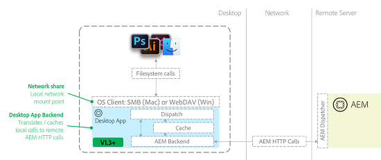

# Best practice per l’app desktop AEM v1.10 {#aem-desktop-app-best-practices}

## Panoramica {#overview}

L&#39;app desktop [!DNL Adobe Experience Manager] collega la tua soluzione di gestione delle risorse digitali (DAM) al desktop in modo da poter aprire i file disponibili nell&#39;interfaccia Web dell&#39;AEM direttamente sul desktop. Se hai salvato una risorsa dal desktop, questa viene caricata su AEM nella posizione appropriata.

L’app desktop AEM elimina la possibilità che tu aggiorni copie locali non corrette o che aggiorni una risorsa errata nell’AEM. Il flusso di lavoro di facile utilizzo dell’app desktop viene attivato utilizzando la tecnologia di condivisione di rete fornita dai sistemi operativi desktop.

L’app desktop monta l’archivio AEM Assets come condivisione di rete sul desktop. Di conseguenza, le cartelle e i file vengono visualizzati come se fossero locali. Tuttavia, non è consigliabile eseguire operazioni di gestione delle risorse digitali direttamente dal desktop nella condivisione di rete montata in Finder o Explorer. Al contrario, Adobe consiglia di utilizzare l’interfaccia utente web di AEM Assets per eseguire operazioni quali copiare o spostare un numero elevato di risorse.

>[!NOTE]
>
>Prima di leggere questo documento, puoi esaminare le [best practice per l&#39;integrazione di AEM e Creative Cloud](https://experienceleague.adobe.com/it/docs/experience-manager-65/content/assets/administer/aem-cc-integration-best-practices) per una panoramica di livello superiore dell&#39;argomento.

## Architettura dell’app desktop AEM {#aem-desktop-app-architecture}

L&#39;app desktop AEM utilizza condivisioni di rete WebDAV (Windows) o SMB (Mac) per il montaggio di condivisioni di rete. La condivisione di rete montata è solo locale. L’app desktop AEM intercetta le chiamate (aperte, lette, scritte) e fornisce memorizzazione nella cache locale aggiuntiva. Traduce le chiamate remote al server AEM Assets per ottimizzare le richieste HTTP AEM. Il diagramma seguente illustra l’architettura dell’app desktop AEM.

*Figura: architettura dell&#39;app desktop*

Quando un file viene salvato, la memorizzazione nella cache aggiuntiva in scrittura assicura che sia memorizzato prima localmente, consentendo all&#39;utente di evitare di attendere il trasferimento di rete. Quindi, dopo un ritardo predefinito (30 secondi), il file viene caricato in AEM in background, e quindi la risorsa viene caricata in AEM. L’app desktop AEM fornisce un’interfaccia utente per monitorare lo stato dei caricamenti di file in background.

## Uso consigliato dell’app desktop AEM {#recommended-use-of-aem-desktop-app}

Le funzionalità principali dell’app desktop AEM includono:

* **Apertura di file dall&#39;interfaccia utente Web di AEM Assets sul desktop**. Dall’interfaccia utente Web, puoi visualizzare le risorse sul desktop (in Finder, Explorer) o aprire una risorsa utilizzando un’applicazione desktop.

* **Estrai e archivia**. Assets può essere estratto per la modifica e contrassegnato come bloccato per l’utente in AEM Assets. Dopo la modifica, la risorsa può essere archiviata per sbloccarla.

* **Salva le modifiche ai file**. Qualsiasi modifica salvata nel file nella condivisione di rete viene caricata automaticamente in AEM e viene creata una nuova versione.

* **Posizionare le risorse collegate in altri documenti**. Nelle applicazioni, ad esempio Creative Cloud ([!DNL Adobe Photoshop], [!DNL Adobe InDesign] e [!DNL Adobe Illustrator]), è possibile inserire un file esterno come collegamento. È ad esempio possibile inserire un&#39;immagine in un documento InDesign. In questo caso, il montaggio della condivisione di rete consente di sfogliare e selezionare le risorse da AEM per il posizionamento. Il posizionamento di file collegati funziona anche in alcune app non Adobi, come MS® Office.

* **Risoluzione di riferimento in AEM**. Se i file inseriti e quelli principali con il collegamento sono memorizzati in AEM, può fornire automaticamente informazioni lato server sui riferimenti alle risorse.

* **Accedi alla risorsa dal desktop**. Nella condivisione di rete montata, un menu contestuale fornisce una finestra di dialogo [!UICONTROL More Info] (anteprima più grande, metadati chiave) e la possibilità di aprire una risorsa nell&#39;interfaccia utente dell&#39;AEM.

* **Caricamento in blocco di cartelle gerarchiche di grandi dimensioni**. Se utilizzi l&#39;opzione **Crea** > **Caricamento cartella** nell&#39;interfaccia utente AEM per caricare le risorse, l&#39;app desktop AEM carica in background la gerarchia di cartelle selezionata su AEM. Nell’app desktop, l’avanzamento del caricamento viene monitorato con un’interfaccia utente dedicata.

## Uso inappropriato dell’app desktop AEM {#inappropriate-use-of-aem-desktop-app}

* Non utilizzare l’app desktop AEM per gestire le risorse dal desktop. L&#39;app desktop AEM non è stata creata per sostituire le unità di rete. Utilizza invece le seguenti funzionalità:

   * Interfaccia web di AEM Assets per la gestione delle risorse digitali (ricerca o condivisione di risorse, metadati e copia o sposta).

   * L&#39;app desktop AEM [!UICONTROL Folder Upload] carica cartelle gerarchiche di grandi dimensioni.

* Non trattare l’app desktop AEM come un client di &quot;sincronizzazione desktop&quot; per AEM Assets. Il vantaggio principale dell’app desktop AEM è che fornisce accesso &quot;virtuale&quot; all’intero archivio e le applicazioni di sincronizzazione desktop in genere sincronizzano solo le risorse appartenenti a un utente. L&#39;app desktop AEM fornisce un certo livello di caching e caricamento in background; tuttavia, funziona in modo molto diverso dalle tipiche applicazioni &quot;Sync&quot;, come l&#39;app desktop Adobe Creative Cloud o Microsoft OneDrive.

* Non utilizzare le unità di rete delle app desktop AEM per salvare frequentemente le risorse. Tutte le operazioni di salvataggio vengono trasmesse ad AEM Assets. Pertanto, non è pratico eseguire operazioni di modifica intensive direttamente nell’archivio AEM Assets montato. La modifica diretta di una risorsa nell’archivio montato genera nella timeline della risorsa versioni irrilevanti e impone costi generali aggiuntivi sul server.

* Non utilizzare l’app desktop AEM per la migrazione di grandi quantità di dati da un’istanza AEM a un’altra. Consulta la [Guida alla migrazione](https://experienceleague.adobe.com/en/docs/experience-manager-65/content/assets/administer/assets-migration-guide) per pianificare ed eseguire le migrazioni delle risorse. L&#39;app desktop [supporta invece il caricamento in blocco](use-app-v1.md#bulkupload) di un numero elevato di risorse per la prima volta in [!DNL Adobe Experience Manager].

## Recommendations per casi d’uso selezionati {#recommendations-for-selected-use-cases}

### Accesso alle risorse per gli utenti creativi {#access-to-assets-for-creative-users}

L’app desktop AEM fornisce accesso virtuale all’intero archivio DAM e potrebbe essere complicato per gli utenti creativi che utilizzano il desktop trovare e accedere alle risorse corrette sul desktop. Utilizza queste best practice per semplificarle.

* Utilizza le funzioni di collaborazione nell’interfaccia utente di AEM Assets Web per fornire all’utente creativo un accesso più diretto alle risorse giuste. Alcuni esempi di cartelle o raccolte condivise, raccolte avanzate (ricerche salvate) o notifiche con puntatori alle risorse giuste. Gli utenti creativi possono quindi utilizzare le azioni del desktop nell’interfaccia web per accedere rapidamente a tali risorse sul desktop.

* Valuta le autorizzazioni appropriate per le risorse (controllo degli accessi) per semplificare la visualizzazione nell’archivio DAM per gli utenti creativi, limitando in pratica l’accesso solo alle risorse di cui hanno bisogno o a cui sono interessati:

   * Alcune aree non rilevanti per gli utenti creativi potrebbero essere negate per i loro gruppi di utenti, per rimuoverli dalla loro vista, anche su desktop.

   * La maggior parte delle risorse in DAM è definitiva e non deve essere modificata: tali risorse devono essere di sola lettura per gli utenti creativi.

   * Solo le risorse che richiedono modifiche o ritocchi devono essere abilitate per la scrittura per gli utenti creativi. Alcune organizzazioni utilizzano i progetti AEM e le cartelle che creano per ospitare risorse ancora soggette a modifiche.

### Ricerca risorse {#searching-assets}

Per cercare un file che si desidera aprire sul desktop:

* Utilizza l’interfaccia utente web di AEM Assets per individuare la risorsa. La ricerca in AEM Assets è potente non solo (facet di ricerca, ricerche salvate), ma offre anche funzionalità aggiuntive per trovare la risorsa giusta. Questi includono filtri aggiuntivi, come la possibilità di cercare le risorse in base allo stato (approvazione, scadenza), raccolte, attività, notifiche e di condividere cartelle/raccolte con altri utenti/gruppi.

* Dopo aver individuato la risorsa, utilizza le azioni desktop nell’interfaccia utente dell’AEM per accedere alla risorsa sul desktop.

### Aggiornamento delle risorse aperte tramite l’app desktop AEM {#updating-assets-opened-using-aem-desktop-app}

Se modifichi una risorsa direttamente nella posizione mappata da AEM Assets a una condivisione di rete locale, la risorsa viene caricata nell’AEM ogni volta che la salvi sul desktop. Inoltre, l’AEM crea una versione e genera le relative rappresentazioni.

Se una risorsa archiviata nell’AEM necessita di un aggiornamento:

* Per **aggiornamenti minori**, ad esempio richieste di ritocco minori nel processo di approvazione:

   * Estrarre il file e aprirlo sul desktop.

   * Aggiorna il file.

   * Salva la versione aggiornata. La risorsa viene aggiornata e nella timeline viene visualizzata la versione originale da confrontare.

* Per **aggiornamenti principali**, ad esempio una richiesta di modifica che richiede un piccolo ciclo WIP creativo:

   * Utilizza l’opzione Mostra per aprire la cartella appropriata sul desktop.

   * Copiare il file in una cartella WIP all&#39;esterno della condivisione AEM Assets mappata (ad esempio, copiare il file in una cartella sincronizzata con l&#39;app desktop Adobe Creative Cloud).

   * Lavorare sul file e salvarlo in modo intermittente. Le modifiche non vengono salvate in AEM Assets.

   * Al termine delle modifiche, sposta, copia o salva il file mappato dall’AEM per caricarlo come nuova versione.

## Prestazioni di rete {#network-performance}

Una buona esperienza utente con l’app desktop AEM si basa su una connettività di rete stabile e su un server ottimizzato, in particolare per il caricamento e l’aggiornamento delle risorse. Queste raccomandazioni sono per i team di rete / IT nelle organizzazioni.

### Considerazioni sulla rete {#network-considerations}

Per informazioni sulle best practice relative alla configurazione della rete AEM Assets, vai al documento [Come eseguire la migrazione in blocco delle risorse](https://experienceleague.adobe.com/en/docs/experience-manager-65/content/assets/administer/assets-migration-guide). Alcuni degli aspetti importanti che contribuiscono a ottimizzare l’esperienza dell’app desktop AEM per gli utenti includono:

* **Utilizza un Dispatcher** configurato correttamente. Utilizza il Dispatcher AEM per una sicurezza aggiuntiva e assicurati che sia configurato per la connessione dell&#39;app desktop [AEM all&#39;AEM dietro un Dispatcher](install-configure-app-v1.md#connect-to-an-aem-instance-behind-a-dispatcher)

* **Salva larghezza di banda**. Quando si esplora l’archivio montato utilizzando il Finder, è consigliabile disattivare l’anteprima delle icone nel Finder su Mac. Il Finder richiede a ogni file di generare un’anteprima e fa sì che l’app desktop scarichi e memorizzi la risorsa nella cache locale. Risparmiando la larghezza di banda, diminuisce anche l’esperienza degli utenti sul desktop, quindi dovrebbe essere fatto quando si lavora su archivi con risorse di grandi dimensioni o con larghezza di banda limitata.

>[!NOTE]
>
>Per disattivare le anteprime delle icone, nel Finder passare a [!UICONTROL View], selezionare [!UICONTROL View Options], quindi deselezionare l&#39;opzione [!UICONTROL Show icon preview]. Funziona solo per la cartella corrente. Per impostarla come predefinita, fare clic sull&#39;opzione [!UICONTROL Use as default] nella stessa finestra di dialogo.

### Ottimizzazione delle prestazioni del server {#optimizing-server-performance}

Per informazioni su come ottimizzare le prestazioni del server AEM Assets, vedere la [Guida all&#39;ottimizzazione delle prestazioni di AEM Assets](https://experienceleague.adobe.com/en/docs/experience-manager-65/content/assets/administer/performance-tuning-guidelines). Alcuni degli aspetti importanti delle prestazioni del server per l’app desktop AEM riguardano l’ottimizzazione della configurazione del flusso di lavoro per garantire prestazioni ottimali per il caricamento delle risorse:

* **Caricamento di risorse più performante**. Configura il modello di flusso di lavoro [Aggiornamento risorse AEM come transitorio](https://experienceleague.adobe.com/en/docs/experience-manager-65/content/assets/administer/performance-tuning-guidelines).

* **Limita CPU server per caricamenti**. Assicurati che il parametro relativo al numero massimo di processi del flusso di lavoro paralleli sia impostato correttamente, in modo che i caricamenti non esauriscano tutta la CPU.
