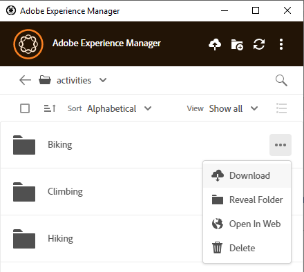
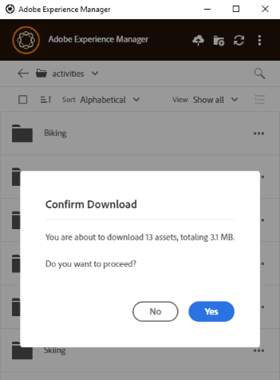

# Scaricare le risorse localmente {#download-assets-locally}

L&#39;app scarica frequentemente le risorse dal server [!DNL Experience Manager] al file system locale. I download occupano spazio su disco e larghezza di banda. Conoscere gli scenari può aiutarti a ottimizzare il tempo di attesa per il completamento dei download. Puoi scaricare le risorse sul file system locale. L&#39;app recupera le risorse dal server [!DNL Experience Manager] e salva la stessa copia nel file system locale.

Fai clic su **[!UICONTROL More actions]**  per le opzioni e fai clic su  per scaricarle.

>[!NOTE]
>
>Quando si scaricano o si caricano uno o più file di grandi dimensioni, l’applicazione disattiva le azioni su risorse e cartelle. Le azioni sono disponibili al termine del download o del caricamento.

Quando si utilizza l&#39;azione [!UICONTROL Open] per aprire una risorsa in un&#39;applicazione desktop nativa, la risorsa viene scaricata localmente se non è già disponibile localmente. Vedi [Apri risorse](#openondesktop-v2).

Quando riveli il percorso di una risorsa o cartella dall’interno dell’app, la risorsa o cartella viene prima scaricata localmente e quindi aperta sul computer nella condivisione di rete locale. Vedi [Apri risorse](#openondesktop-v2).

Quando si utilizza l&#39;azione [!UICONTROL Edit] per modificare una risorsa in un&#39;applicazione desktop nativa, la risorsa viene scaricata localmente se non è già disponibile localmente. Consulta [Modifica risorse e carica risorse aggiornate in [!DNL Experience Manager]](#edit-assets-upload-updated-assets).

Se l&#39;app è installata e autorizzata a, completa le azioni quando utilizzi [!UICONTROL Desktop Actions] dall&#39;interfaccia Web [!DNL Experience Manager]. L’app scarica prima la risorsa e quindi completa l’azione.

## Scaricare più risorse {#download-multiple-assets}

Il download di più risorse può causare prestazioni insoddisfacenti se la coda è di grandi dimensioni o si verificano problemi di rete. Inoltre, quando si scarica una cartella è possibile mettere in coda inconsapevolmente molte risorse da scaricare. Per evitare lunghi tempi di attesa, l’app limita il numero di risorse scaricate contemporaneamente. Per informazioni su come configurarlo, vedere [Impostare le preferenze](install-upgrade.md#set-preferences). Anche al di sotto di questo limite, a volte l’app può cercare una conferma prima di scaricare una cartella apparentemente grande.

Se le cartelle sono selezionate e scaricate, l&#39;applicazione scarica solo le risorse memorizzate direttamente nelle cartelle in [!DNL Experience Manager]. Non scarica automaticamente le risorse dalle sottocartelle.

## Passaggi successivi {#next-steps}

* [Guarda un video per iniziare a utilizzare l’app desktop Adobe Experience Manager](https://experienceleague.adobe.com/it/docs/experience-manager-learn/assets/creative-workflows/aem-desktop-app)

* Fornisci feedback sulla documentazione utilizzando [!UICONTROL Edit this page]  o [!UICONTROL Log an issue]  disponibile nella barra laterale a destra

* Contatta il [Servizio clienti](https://experienceleague.adobe.com/it?support-solution=General#support)

>[!MORELIKETHIS]
>
>* [Carica risorse](/help/using/upload-assets.md)
>* [Interfaccia utente](/help/using/user-interface.md)
>* [Ricerca](/help/using/search.md)
