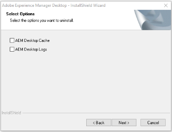

# Installa app desktop [!DNL Adobe Experience Manager] {#install-app-v2}

Utilizzando l&#39;app desktop [!DNL Adobe Experience Manager], le risorse di [!DNL Experience Manager] sono facilmente disponibili sul desktop locale e possono essere utilizzate in qualsiasi applicazione desktop nativa. Assets può essere visualizzato in anteprima e aperto nelle app desktop. Possono essere visualizzati nel Finder o in Explorer per l&#39;utilizzo nei documenti e modificati localmente. Le modifiche vengono salvate nuovamente in [!DNL Experience Manager], creando una nuova versione al momento del caricamento.

Tale integrazione consente a vari ruoli dell’organizzazione di:

* Gestire le risorse centralmente in [!DNL Experience Manager Assets].

* Accedi alle risorse in qualsiasi applicazione desktop nativa, incluse le applicazioni di terze parti e in Adobe Creative Cloud. In questo modo gli utenti possono aderire facilmente ai vari standard, compreso il branding.

Per utilizzare l&#39;app desktop [!DNL Experience Manager]:

* Verificare che la versione di [!DNL Experience Manager] sia compatibile con l&#39;app desktop [!DNL Experience Manager].

* Scarica e installa l’applicazione. Consulta [installare l&#39;app desktop](#install-v2) di seguito.

* Verifica la connessione utilizzando alcune risorse. Consulta [come sfogliare e cercare le risorse](using.md#browse-search-preview-assets).

## Requisiti di sistema, prerequisiti e collegamenti per il download {#tech-specs-v2}

Per informazioni dettagliate, consulta le [[!DNL Experience Manager] note sulla versione dell&#39;app desktop](release-notes.md).

## Aggiornamento da una versione precedente {#upgrade-from-previous-version}

Se utilizzi la versione 1.x dell’app desktop, comprendi le differenze e le analogie tra la versione precedente e quella più recente dell’app. Consulta [le novità dell&#39;app desktop](introduction.md#whats-new-v2) e [il funzionamento dell&#39;app](release-notes.md#how-app-works).

>[!NOTE]
>
>Due versioni di un&#39;app desktop non possono coesistere in un computer. Prima di installare una versione, disinstalla l’altra versione.

Per effettuare l’aggiornamento da una versione precedente dell’app, segui queste istruzioni:

1. Prima dell&#39;aggiornamento, sincronizza tutte le risorse e carica le modifiche in [!DNL Experience Manager]. In questo modo si evita di perdere eventuali modifiche durante la disinstallazione dell’app.

1. Disinstalla la versione precedente dell’app. Durante la disinstallazione, selezionare l&#39;opzione per cancellare la cache.

1. Riavvia il computer.

1. [Scarica](release-notes.md) e [installa](#install-v2) l&#39;app più recente. Seguire le istruzioni riportate di seguito.

## Installa {#install-v2}

Per installare l’app desktop, segui la procedura riportata di seguito. Disinstalla l&#39;app desktop di Adobe [!DNL Experience Manager] v1.x esistente prima di installare l&#39;app più recente. Per ulteriori informazioni, vedi sopra.

1. Scarica il programma di installazione più recente dalla pagina [note sulla versione](release-notes.md).

1. Mantieni a portata di mano l&#39;URL e le credenziali della distribuzione di [!DNL Experience Manager].

1. Se stai eseguendo l&#39;aggiornamento da un&#39;altra versione dell&#39;app, consulta [aggiornare l&#39;app desktop](#upgrade-from-previous-version).

1. Ignora questo passaggio se utilizzi [!DNL Experience Manager] come [!DNL Cloud Service], [!DNL Experience Manager] 6.4.4 o versione successiva oppure [!DNL Experience Manager] 6.5.0 o versione successiva. Assicurati che la tua configurazione di [!DNL Experience Manager] soddisfi i requisiti di compatibilità indicati nelle [note sulla versione](release-notes.md). Se necessario, scaricare il [pacchetto di compatibilità](https://experience.adobe.com/#/downloads/content/software-distribution/en/aem.html?package=/content/software-distribution/en/details.html/content/dam/aem/public/adobe/packages/cq640/featurepack/adobe-asset-link-support) applicabile e installarlo utilizzando Gestione pacchetti [!DNL Experience Manager] come amministratore [!DNL Experience Manager]. Per installare un pacchetto, vedere [Come utilizzare i pacchetti](https://experienceleague.adobe.com/it/docs/experience-manager-65/content/sites/administering/contentmanagement/package-manager).

1. Eseguire il file binario del programma di installazione e seguire le istruzioni visualizzate per l&#39;installazione.

1. In Windows, è possibile che venga richiesto di installare `Visual Studio C++ Redistributable 2015`. Seguire le istruzioni visualizzate sullo schermo per installarlo. Se l&#39;installazione non riesce, installarla manualmente. Scaricare il programma di installazione da [qui](https://www.microsoft.com/en-us/download/details.aspx?id=52685) e installare i file `vc_redist.x64.exe` e `vc_redist.x86.exe`. Rieseguire il programma di installazione dell&#39;app desktop [!DNL Experience Manager].

1. Riavviare il computer come richiesto. Avvia e configura l’app desktop.

1. Per connettere l&#39;app a un archivio [!DNL Experience Manager], fare clic sull&#39;icona dell&#39;app nell&#39;area di notifica e avviare l&#39;app. Specificare l&#39;indirizzo del server [!DNL Experience Manager] nel formato `https://[aem_server]:[port]/`.

   Fare clic su **[!UICONTROL Connect]** e fornire le credenziali.

   

   *Figura: schermata di connessione all&#39;indirizzo del server di input.*

   Selezionare **[!UICONTROL Remember Connection]** per evitare di immettere i dettagli di connessione ogni volta che si accede all&#39;app desktop.

   >[!CAUTION]
   >
   >Verificare che non siano presenti spazi iniziali o finali prima o dopo l&#39;indirizzo del server [!DNL Experience Manager]. In caso contrario, l&#39;app non può connettersi al server [!DNL Experience Manager].

1. [Facoltativo] Fare clic su **[!UICONTROL I want to connect a different way]** e su **[!UICONTROL Adobe login]** per accedere al server Experience Manager Assets utilizzando Adobe Identity Management Service (IMS). L’accesso IMS consente all’app desktop di eseguire automaticamente l’aggiornamento del token di accesso, consentendo all’utente di rimanere connesso per un massimo di 14 giorni. Fare clic su **[!UICONTROL Direct login]** per eseguire l&#39;accesso standard al server [!DNL Experience Manager] utilizzando le credenziali utente.

   

1. Una volta stabilita la connessione, è possibile visualizzare l&#39;elenco delle cartelle e delle risorse disponibili nella cartella principale del DAM [!DNL Experience Manager]. Puoi sfogliare le cartelle dall’interno dell’app.

   

   *Figura: l&#39;applicazione visualizza il contenuto DAM dopo l&#39;accesso*

1. ([!DNL Experience Manager] 6.5.1 o versione successiva) Se si utilizza l&#39;app desktop con [!DNL Experience Manager] 6.5.1 o versione successiva, aggiornare il connettore S3 o Azure alla versione 1.10.4 o successiva. Vedere [Connettore Azure](https://experienceleague.adobe.com/it/docs/experience-manager-65/content/implementing/deploying/deploying/data-store-config#azure-data-store) o [Connettore S3](https://experienceleague.adobe.com/it/docs/experience-manager-65/content/implementing/deploying/deploying/data-store-config#amazon-s-data-store).

   Se sei un cliente Adobe di Managed Services (AMS), contatta l’Assistenza clienti Adobe.

## Impostare le preferenze {#set-preferences}

Per modificare le preferenze, fare clic su  e **[!UICONTROL Preference]** . Nella finestra **[!UICONTROL Preferences]**, regolare i valori dei seguenti elementi:

* [!UICONTROL Launch the application on logon].

* [!UICONTROL Show a window when the application starts].

* **[!UICONTROL Cache Directory]**: posizione della cache locale dell&#39;app (contiene le risorse scaricate localmente).

* **[!UICONTROL Network Drive Letter]**: lettera di unità utilizzata per il mapping al DAM [!DNL Experience Manager]. Non modificare la lettera dell&#39;unità di rete se non si è sicuri. L&#39;app può essere mappata su qualsiasi lettera di unità in Windows. Se due utenti inseriscono risorse da lettere di unità diverse, non possono vedere le risorse posizionate l’uno dall’altro. Il percorso delle risorse cambia. Le risorse rimangono nel file binario (ad esempio, INDD) e non vengono rimosse. L&#39;app elenca tutte le lettere di unità disponibili e per impostazione predefinita utilizza l&#39;ultima lettera disponibile che è in genere `Z`.

* **[!UICONTROL Maximum Cache Size]**: cache consentita sul disco rigido in GB utilizzata per l&#39;archiviazione delle risorse scaricate localmente.

* **[!UICONTROL Current cache size]**: dimensione di archiviazione delle risorse scaricate localmente. Le informazioni vengono visualizzate solo dopo il download delle risorse tramite l’app.

* **[!UICONTROL Automatically download linked assets]**: quando si scarica il file originale, le risorse inserite nelle app di Creative Cloud native supportate vengono recuperate automaticamente.

* **[!UICONTROL Maximum number of downloads]**:  Cambia con cautela. Quando si scaricano le risorse per la prima volta (tramite l’opzione Mostra, Apri, Modifica, Scarica o simile), le risorse vengono scaricate solo se il batch contiene meno di questo numero. Il valore predefinito è 50. Non cambiare se non si è sicuri. L’aumento del valore può causare tempi di attesa più lunghi, mentre una riduzione di questo valore potrebbe impedire di scaricare tutte le risorse o cartelle necessarie in un unico tentativo.

* **[!UICONTROL Use legacy conventions when creating nodes for assets and folders]**:  Cambia con cautela. Questa impostazione consente all’app di emulare il comportamento dell’app v1.10 durante il caricamento delle cartelle. Nella versione 1.10, i nomi dei nodi creati nell’archivio rispettano gli spazi e le maiuscole/minuscole dei nomi delle cartelle forniti dall’utente. Tuttavia, nella versione 2.1 dell’app, gli spazi in più nei nomi delle cartelle vengono convertiti in trattini. Ad esempio, il caricamento di `New Folder` o `new   folder` crea lo stesso nodo nell&#39;archivio se l&#39;opzione non è selezionata e il comportamento predefinito nella versione v2.1 viene mantenuto. Se questa opzione è selezionata, nell’archivio vengono creati nodi diversi per le due cartelle precedenti e il comportamento corrisponde a quello dell’app v1.10.

  Il comportamento predefinito della versione 2.1 rimane invariato: sostituisce più spazi nei nomi delle cartelle con trattini nel nome del nodo dell’archivio e converte i nomi dei nodi in minuscolo.

* **[!UICONTROL Upload Acceleration]**:  Cambia con cautela. Quando si caricano le risorse, l’applicazione può utilizzare i caricamenti simultanei per migliorare la velocità di caricamento. Per aumentare la concorrenza del caricamento, sposta il cursore verso destra. Il dispositivo di scorrimento all’estrema sinistra significa assenza di concorrenza (caricamento a thread singolo), la posizione centrale corrisponde a dieci thread simultanei e il limite massimo all’estrema destra corrisponde a 20 thread simultanei. Un limite di concorrenza più elevato richiede più risorse.

Per aggiornare le preferenze non disponibili, disconnettersi dal server [!DNL Experience Manager] e quindi eseguire l&#39;aggiornamento. Dopo aver aggiornato le preferenze, fai clic su .


*Figura: preferenze dell&#39;app desktop.*

### Supporto proxy {#proxy-support}

L&#39;app desktop [!DNL Experience Manager] utilizza il proxy predefinito del sistema per connettersi a Internet tramite HTTPS. L&#39;app può connettersi solo utilizzando un proxy di rete che non richiede autenticazione aggiuntiva.

Se si configurano o si modificano le impostazioni del server proxy per Windows (Opzioni Internet > Impostazioni LAN), riavviare l&#39;app desktop [!DNL Experience Manager] per rendere effettive le modifiche. La configurazione proxy viene applicata all&#39;avvio dell&#39;app desktop. Per rendere effettive le modifiche, chiudi e riavvia l’app.

Se il proxy richiede l&#39;autenticazione, il team IT può consentire l&#39;URL [!DNL Experience Manager Assets] nelle impostazioni del server proxy per consentire il passaggio del traffico dell&#39;applicazione.

## Disinstallare l’app {#uninstall-the-app}

Per disinstallare l&#39;applicazione in Windows, eseguire la procedura seguente:

1. Carica tutte le modifiche in [!DNL Experience Manager] per evitare di perdere le modifiche. Consulta [Modifica risorse e carica risorse aggiornate in [!DNL Experience Manager]](using.md#edit-assets-upload-updated-assets). Disconnettersi e [!UICONTROL Exit] l&#39;app.

1. Rimuovi l’app come rimuoveresti qualsiasi altra applicazione del sistema operativo. Disinstallarlo da Aggiungi e rimuovi programmi in Windows.

1. Per rimuovere la cache e i registri, seleziona la casella di controllo necessaria.

   

1. Seguire le istruzioni visualizzate. Al termine, riavviare il computer.

Per disinstallare l&#39;applicazione su Mac, eseguire la procedura seguente:

1. Carica tutte le modifiche in [!DNL Experience Manager] per evitare di perdere le modifiche. Consulta [Modifica risorse e carica risorse aggiornate in [!DNL Experience Manager]](using.md#edit-assets-upload-updated-assets). Disconnettersi e [!UICONTROL Exit] l&#39;app.

1. Rimuovi `Adobe Experience Manager Desktop.app` da `/Applications`.

In alternativa, per pulire le cache interne dell’applicazione sul Mac e disinstallare l’app, puoi eseguire il seguente comando nel terminale:

```shell
/Applications/Adobe Experience Manager Desktop/Contents/Resources/uninstall-osx/uninstall.sh
```
