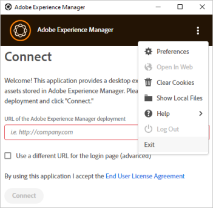

# Risoluzione dei problemi relativi all&#39;app desktop [!DNL Adobe Experience Manager] {#troubleshoot-v2}

L&#39;app desktop [!DNL Adobe Experience Manager] si connette all&#39;archivio DAM (Digital Asset Management) di una distribuzione [!DNL Experience Manager]. L’app recupera sul computer le informazioni dell’archivio e i risultati della ricerca, scarica e carica file e cartelle e include funzionalità per gestire i conflitti con l’interfaccia utente di Assets.

Continua a leggere per risolvere i problemi dell’app, scoprire le best practice e le limitazioni.

## Best practice {#best-practices-to-prevent-troubles}

Per evitare alcuni problemi comuni e la relativa risoluzione, attieniti alle seguenti best practice.

* **Comprendere come funziona l&#39;app desktop**: prima di iniziare a utilizzare l&#39;applicazione, prova a conoscere il funzionamento dell&#39;app. Informazioni sui collegamenti tra l&#39;interfaccia Web di [!DNL Experience Manager] e il desktop, sulla mappatura dell&#39;archivio, sulla memorizzazione nella cache delle risorse, sul salvataggio locale e sul caricamento in background. Vedi [come funziona](release-notes.md#how-app-works).

* **Evitare caratteri non supportati nei nomi delle cartelle**: non utilizzare spazi vuoti e caratteri non validi durante la creazione o il caricamento di cartelle. Visualizza un elenco di caratteri in [Crea cartelle in [!DNL Adobe Experience Manager Assets]](https://experienceleague.adobe.com/it/docs/experience-manager-65/content/assets/managing/manage-assets#creating-folders). I caratteri non supportati nel nome della cartella possono influire su alcuni casi d&#39;uso di [!DNL Experience Manager].

* **Best practice per evitare conflitti**: per evitare potenziali conflitti durante la collaborazione su più risorse, vai a [evitare conflitti di modifica](assets-management-tasks.md#adv-workflow-collaborate-avoid-conflicts).

* **Utilizza il caricamento delle cartelle per le cartelle gerarchiche di grandi dimensioni**: anziché utilizzare l&#39;interfaccia Web di Assets o altri metodi, utilizza l&#39;app desktop [!DNL Experience Manager] per caricare cartelle di grandi dimensioni. L’app carica le risorse in background con la registrazione e il monitoraggio. Consulta [risorse per caricamento in blocco](using-desktop-app.md#bulk-upload-assets).

* **Usa la versione più recente**: usa la versione più recente dell&#39;app. Verificare sempre la compatibilità prima di installare una nuova versione dell&#39;app o prima di eseguire l&#39;aggiornamento a una versione [!DNL Experience Manager] più recente. Consulta le [note sulla versione](release-notes.md).

* **Usa la stessa lettera di unità**: utilizza la stessa lettera di unità in un&#39;organizzazione per eseguire il mapping al DAM [!DNL Experience Manager]. Per visualizzare le risorse posizionate da altri utenti, i percorsi devono essere gli stessi. L’utilizzo della stessa lettera di unità garantisce un percorso costante per le risorse DAM. Le risorse rimangono posizionate e non vengono rimosse anche se utenti diversi utilizzano lettere di unità diverse.

* **Attenzione alla rete**: le prestazioni della rete sono fondamentali per le prestazioni dell&#39;app desktop [!DNL Experience Manager]. Se la risposta ai trasferimenti di file o alle operazioni in blocco risulta più lenta, disattivare le funzionalità o le app che potrebbero causare un notevole traffico di rete.

* **Casi d&#39;uso non supportati per l&#39;app desktop**: evita di utilizzare l&#39;app per la migrazione delle risorse, in quanto richiede strumenti di pianificazione e aggiuntivi. Non è inoltre adatto per operazioni DAM complesse, come lo spostamento di cartelle di grandi dimensioni, caricamenti di grandi dimensioni o ricerche avanzate di metadati. Inoltre, non utilizzarlo come client di sincronizzazione, in quanto i principi di progettazione e i modelli di utilizzo sono diversi da client di sincronizzazione come Microsoft OneDrive o Adobe Creative Cloud Desktop Sync.

* **Timeout**: l&#39;app desktop non dispone attualmente di un valore di timeout configurabile che disconnette la connessione tra il server [!DNL Experience Manager] e l&#39;app desktop dopo un intervallo di tempo fisso. Quando si caricano risorse di grandi dimensioni, se dopo un po’ la connessione si interrompe, l’app ritenta di caricare la risorsa un paio di volte, aumentando il timeout di caricamento. Non esiste un metodo consigliato per modificare le impostazioni di timeout predefinite.

## Come risolvere i problemi {#troubleshooting-prep}

Per risolvere i problemi relativi all’app desktop, tieni presente le seguenti informazioni. Inoltre, se scegli di richiedere assistenza, ti prepara a trasmettere meglio i problemi all’Assistenza clienti di Adobe.

### Percorso dei file di registro {#check-log-files-v2}

L&#39;app desktop [!DNL Experience Manager] memorizza i file di registro nei percorsi seguenti, a seconda del sistema operativo:

In Windows: `%LocalAppData%\Adobe\AssetsCompanion\Logs`

In Mac: `~/Library/Logs/Adobe\ Experience\ Manager\ Desktop`

Quando si caricano molte risorse, se alcuni file non vengono caricati, vedere il file `backend.log` per identificare i caricamenti non riusciti.

>[!NOTE]
>
>Quando si collabora con l’Assistenza clienti di Adobe per una richiesta o un ticket di supporto, è possibile richiedere di condividere i file di registro per aiutare il team di Assistenza clienti a comprendere il problema. Archivia l&#39;intera cartella `Logs` e condividila con il contatto dell&#39;Assistenza clienti.

### Cambia il livello di dettagli nei file di registro {#level-of-details-in-log}

Per modificare il livello dei dettagli nei file di registro:

1. Verificare che l&#39;applicazione non sia in esecuzione.

1. Sul sistema Windows:

   1. Aprire una finestra di comando.

   1. Avvia l&#39;app desktop [!DNL Adobe Experience Manager] eseguendo il comando:

   ```shell
   set AEM_DESKTOP_LOG_LEVEL=DEBUG&"C:\Program Files\Adobe\Adobe Experience Manager Desktop.exe
   ```

   Sul sistema Mac:

   1. Apri una finestra del terminale.

   1. Avvia l&#39;app desktop [!DNL Adobe Experience Manager] eseguendo il comando:

   ```shell
   AEM_DESKTOP_LOG_LEVEL=DEBUG open /Applications/Adobe\ Experience\ Manager\ Desktop.app
   ```

I livelli di registro validi sono DEBUG, INFO, WARN o ERROR. Il livello di dettaglio dei registri è il più alto in DEBUG e il più basso in ERROR.

### Abilita modalità di debug {#enable-debug-mode}

Per la risoluzione dei problemi, puoi abilitare la modalità di debug e ottenere ulteriori informazioni nei registri.

>[!NOTE]
>
>I livelli di registro validi sono DEBUG, INFO, WARN o ERROR. Il livello di dettaglio dei registri è il più alto in DEBUG e il più basso in ERROR.

Per utilizzare l’app in modalità di debug su Mac:

1. Aprire una finestra del terminale o un prompt dei comandi.

1. Avvia l&#39;app desktop [!DNL Experience Manager] eseguendo il comando seguente:

   `AEM_DESKTOP_LOG_LEVEL=DEBUG open /Applications/Adobe\ Experience\ Manager\ Desktop.app`.

Per attivare la modalità di debug in Windows:

1. Aprire una finestra di comando.

1. Avvia l&#39;app desktop [!DNL Experience Manager] eseguendo il comando seguente:

`AEM_DESKTOP_LOG_LEVEL=DEBUG&"C:\Program Files\Adobe\Adobe Experience Manager Desktop.exe`.

### Conoscere la versione dell&#39;app desktop [!DNL Adobe Experience Manager] {#know-app-version-v2}

Per visualizzare il numero di versione:

1. Avvia l’applicazione.

1. Fai clic sull&#39;ellissi nell&#39;angolo superiore destro, passa il puntatore su [!UICONTROL Help] e fai clic su [!UICONTROL About].

   Il numero di versione è elencato in questa schermata.

### Cancella cache {#clear-cache-v2}

Effettua le seguenti operazioni:

1. Avviare l&#39;applicazione e connettersi a un&#39;istanza di [!DNL Experience Manager].

1. Aprire le preferenze dell&#39;applicazione facendo clic sui puntini di sospensione nell&#39;angolo superiore destro e selezionando [!UICONTROL Preferences].

1. Individuare la voce che visualizza [!UICONTROL Current Cache Size]. Fai clic sull’icona del cestino accanto a questo elemento.

Per cancellare la cache manualmente, effettuare le seguenti operazioni:

>[!CAUTION]
>
>Questi passaggi sono potenzialmente distruttivi. Se sono presenti modifiche al file locale non caricate in [!DNL Adobe Experience Manager], tali modifiche andranno perse.

La cache viene cancellata eliminando la directory cache dell&#39;applicazione, che si trova nelle preferenze dell&#39;applicazione.

1. Avvia l’applicazione.

1. Aprire le preferenze dell&#39;applicazione selezionando i puntini di sospensione nell&#39;angolo superiore destro e selezionando [!UICONTROL Preferences].

1. Nota il valore [!UICONTROL Cache Directory].

   In questa directory sono presenti sottodirectory denominate in base agli endpoint [!DNL Adobe Experience Manager] codificati. I nomi sono una versione codificata dell&#39;URL [!DNL Adobe Experience Manager] di destinazione. Ad esempio, se l&#39;applicazione è destinata a `localhost:4502`, il nome della directory è `localhost_4502`.

Per cancellare la cache, eliminare la directory dell&#39;endpoint [!DNL Adobe Experience Manager] codificato desiderata. In alternativa, l&#39;eliminazione dell&#39;intera directory specificata nelle preferenze comporta la cancellazione della cache per tutte le istanze utilizzate dall&#39;applicazione.

La cancellazione della cache dell&#39;app desktop [!DNL Adobe Experience Manager] è un&#39;attività preliminare di risoluzione dei problemi che può risolvere diversi problemi. Cancella la cache dalle preferenze dell’app. Vedi [imposta preferenze](install-upgrade.md#set-preferences). La posizione predefinita della cartella della cache è:

## Impossibile visualizzare le risorse inserite {#placed-assets-missing}

Se non riesci a visualizzare le risorse inserite da te o da altri professionisti creativi nei file di supporto (ad esempio, file INDD), verifica quanto segue:

* Connessione al server. Una connettività di rete inadeguata può bloccare i download delle risorse.

* Dimensione file. Il download e la visualizzazione delle risorse di grandi dimensioni richiedono più tempo.

* Coerenza lettera unità. Se le risorse inserite durante la mappatura del DAM [!DNL Experience Manager] su una lettera di unità diversa sono state posizionate da te o da un altro collaboratore, le risorse inserite non vengono visualizzate.

* Autorizzazioni. Per verificare se si dispone delle autorizzazioni per recuperare le risorse inserite, contattare l&#39;amministratore [!DNL Experience Manager].

### Le modifiche apportate ai file nell&#39;interfaccia utente dell&#39;app desktop non vengono immediatamente applicate in [!DNL Adobe Experience Manager] {#changes-on-da-not-visible-on-aem}

L&#39;app desktop [!DNL Adobe Experience Manager] consente all&#39;utente di decidere quando tutte le modifiche apportate a un file sono state completate. A seconda delle dimensioni e della complessità di un file, il trasferimento della nuova versione di un file in [!DNL Adobe Experience Manager] richiede molto tempo. L’applicazione è progettata per ridurre al minimo il numero di trasferimenti di file, anziché caricare automaticamente i file in base al completamento ipotizzato delle modifiche. È consigliabile che l&#39;utente avvii nuovamente il trasferimento del file in [!DNL Adobe Experience Manager] scegliendo di caricare le modifiche di un file.

### Problemi durante l’aggiornamento su macOS {#issues-when-upgrading-on-macos}

Talvolta possono verificarsi problemi durante l&#39;aggiornamento dell&#39;app desktop [!DNL Experience Manager] su macOS. Problemi causati dalle cartelle di sistema legacy per l&#39;app desktop [!DNL Experience Manager]. Le cartelle impediscono il caricamento corretto delle nuove versioni dell&#39;app desktop [!DNL Experience Manager]. Per risolvere questo problema, è possibile rimuovere manualmente le cartelle e i file seguenti.

Prima di eseguire i passaggi seguenti, trascinare l&#39;applicazione `Adobe Experience Manager Desktop` dalla cartella macOS Applications nel cestino. Quindi aprire il terminale, eseguire il comando seguente e fornire la password quando richiesto.

```shell
sudo rm -rf ~/Library/Application\ Support/com.adobe.aem.desktop
sudo rm -rf ~/Library/Preferences/com.adobe.aem.desktop.plist
sudo rm -rf ~/Library/Logs/Adobe\ Experience\ Manager\ Desktop

sudo find /var/folders -type d -name "com.adobe.aem.desktop" | xargs rm -rf
sudo find /var/folders -type d -name "com.adobe.aem.desktop.finderintegration-plugin" | xargs rm -rf
```

## Impossibile caricare i file {#upload-fails}

Se utilizzi l&#39;app desktop con [!DNL Experience Manager] 6.5.1 o versione successiva, aggiorna il connettore S3 o Azure alla versione 1.10.4 o successiva. Risolve il problema di errore di caricamento del file relativo a [OAK-8599](https://issues.apache.org/jira/browse/OAK-8599). Consulta le [istruzioni di installazione](install-upgrade.md#install-v2).

## [!DNL Experience Manager] problemi di connessione all&#39;app desktop {#connection-issues}

Se si verificano problemi generali di connettività, ecco alcuni modi per ottenere ulteriori informazioni sulle operazioni dell&#39;app desktop [!DNL Experience Manager].

**Controllare il registro richieste**

L&#39;app desktop [!DNL Experience Manager] registra tutte le richieste inviate, insieme al codice di risposta di ogni richiesta, in un file di registro dedicato.

1. Apri `request.log` nella directory del registro dell&#39;applicazione per visualizzare queste richieste.

1. Ogni riga del registro rappresenta una richiesta o una risposta. Le richieste hanno un carattere `>` seguito dall&#39;URL richiesto. Le risposte hanno un carattere `<` seguito dal codice di risposta e dall&#39;URL richiesto. Le richieste e le risposte possono essere associate utilizzando il GUID di ogni riga.

**Controlla le richieste caricate dal browser incorporato dell&#39;applicazione**

La maggior parte delle richieste dell’applicazione si trova nel registro delle richieste. Tuttavia, se non ci sono informazioni utili, può essere utile esaminare le richieste inviate dal browser incorporato dell’applicazione.
Per istruzioni su come visualizzare queste richieste, consulta la [sezione SAML](#da-connection-issue-with-saml-aem).

### L’autenticazione dell’accesso SAML non funziona {#da-connection-issue-with-saml-aem}

L&#39;app desktop [!DNL Experience Manager] potrebbe non connettersi alla distribuzione [!DNL Adobe Experience Manager] abilitata per SSO (SAML). La progettazione dell’applicazione tenta di adattarsi alle varianti e alle complessità delle connessioni e dei processi SSO. Tuttavia, una configurazione potrebbe richiedere una risoluzione dei problemi aggiuntiva.

A volte il processo SAML non reindirizza al percorso richiesto originariamente. In alternativa, il reindirizzamento finale è a un host diverso da quello configurato nell&#39;app desktop [!DNL Adobe Experience Manager]. Per verificare che il problema non si verifichi, effettuare le seguenti operazioni:

1. Aprire un browser Web. Accedi all&#39;URL `https://[aem_server]:[port]/content/dam.json`.

1. Accedere alla distribuzione [!DNL Adobe Experience Manager].

1. Al termine dell’accesso, controlla l’indirizzo corrente del browser nella barra degli indirizzi. Deve corrispondere esattamente all’URL immesso inizialmente.

1. Verificare inoltre che tutto ciò che precede `/content/dam.json` corrisponda al valore [!DNL Adobe Experience Manager] di destinazione configurato nelle impostazioni dell&#39;app desktop [!DNL Adobe Experience Manager].

**Il processo SAML di accesso funziona correttamente in base ai passaggi precedenti, ma gli utenti non sono ancora in grado di accedere**

La finestra nell&#39;app desktop [!DNL Adobe Experience Manager] che visualizza il processo di accesso è semplicemente un browser Web che visualizza l&#39;interfaccia utente Web dell&#39;istanza di [!DNL Adobe Experience Manager] di destinazione:

* La versione di Mac utilizza un [WebView](https://developer.apple.com/documentation/webkit/webview).

* La versione di Windows utilizza [CefSharp](https://cefsharp.github.io/) basato su Chromium.

Assicurati che il processo SAML supporti tali browser.

Per risolvere ulteriori problemi, è possibile visualizzare gli URL esatti che il browser sta tentando di caricare. Per visualizzare queste informazioni:

1. Seguire le istruzioni per avviare l&#39;applicazione in [modalità debug](#enable-debug-mode).

1. Riproduci il tentativo di accesso.

1. Passare alla [directory del registro](#check-log-files-v2) dell&#39;applicazione.

1. Per Windows:

   1. Aprire &quot;aemcompanionlog.txt&quot;.

   1. Cerca i messaggi che iniziano con &quot;Indirizzo browser di accesso cambiato in&quot;. Queste voci contengono anche l’URL caricato dall’applicazione.

   Per Mac:

   1. In `com.adobe.aem.desktop-nnnnnnnn-nnnnnn.log`, i numeri presenti nel nome di file più recente sostituiscono **n**.

   1. Cercare i messaggi che iniziano con il frame caricato. Queste voci contengono anche l’URL caricato dall’applicazione.

Osservando la sequenza URL in fase di caricamento è possibile risolvere eventuali problemi alla fine del SAML per determinare l’errore.

### Problema di configurazione SSL {#ssl-config-v2}

Le librerie utilizzate dall&#39;app desktop [!DNL Experience Manager] per la comunicazione HTTP utilizzano una rigida applicazione SSL. A volte una connessione può riuscire utilizzando un browser, ma non riesce quando si utilizza l&#39;app desktop [!DNL Experience Manager]. Per configurare SSL in modo appropriato, installa il certificato intermedio mancante in Apache. Vedi [Come installare un certificato CA intermedio in Apache](https://access.redhat.com/solutions/43575).

Le librerie utilizzate dall&#39;app desktop [!DNL Experience Manager] per la comunicazione HTTP utilizzano una rigorosa applicazione SSL. Pertanto, possono verificarsi casi in cui le connessioni SSL riuscite tramite un browser non riescono con l&#39;app desktop [!DNL Adobe Experience Manager]. Questo risultato è positivo perché incoraggia la corretta configurazione di SSL e aumenta la sicurezza, ma può essere frustrante quando l’applicazione non è in grado di connettersi.

In questo caso, l’approccio consigliato è quello di utilizzare uno strumento per analizzare il certificato SSL di un server e identificare i problemi in modo che possano essere corretti. Esistono siti Web che controllano il certificato di un server fornendo il relativo URL.

Come misura temporanea, è possibile disabilitare l&#39;imposizione SSL rigorosa nell&#39;app desktop [!DNL Adobe Experience Manager]. Questo approccio non è una soluzione consigliata a lungo termine, in quanto riduce la sicurezza nascondendo la causa principale di SSL configurato in modo errato. Per disattivare l&#39;applicazione rigorosa:

1. Utilizza l’editor che preferisci per modificare il file di configurazione JavaScript dell’applicazione, che si trova (per impostazione predefinita) nelle seguenti posizioni (a seconda del sistema operativo):

   In Mac: `/Applications/Adobe Experience Manager Desktop.app/Contents/Resources/javascript/lib-smb/config.json`

   In Windows: `C:\Program Files (x86)\Adobe\Adobe Experience Manager Desktop\javascript\config.json`

1. Individua la seguente sezione nel file:

   ```shell
   ...
   "assetRepository": {
       "options": {
   ...
   ```

1. Modificare la sezione aggiungendo `"strictSSL": false` come segue:

   ```shell
   ...
   "assetRepository": {
       "options": {
           "strictSSL": false,
   ...
   ```

1. Salvare il file e riavviare l&#39;app desktop [!DNL Adobe Experience Manager].

### Problemi di accesso quando si passa a un altro server {#cannot-login-cookies-issue}

Dopo aver utilizzato un server [!DNL Experience Manager], quando si tenta di modificare la connessione a un altro server, potrebbero verificarsi problemi di accesso. Ciò è dovuto all’interferenza dei vecchi cookie con la nuova autenticazione. Un&#39;opzione nel menu principale per [!UICONTROL Clear Cookies] aiuta. Uscire dalla sessione corrente nell&#39;app e selezionare [!UICONTROL Clear Cookies] prima di procedere alla connessione.



## L’app non risponde {#unresponsive}

Raramente l’applicazione potrebbe bloccarsi, visualizzare solo una schermata bianca o visualizzare un errore nella parte inferiore dell’interfaccia senza opzioni. Provare quanto segue nell&#39;ordine:

* Fare clic con il pulsante destro del mouse sull&#39;interfaccia dell&#39;applicazione e scegliere **[!UICONTROL Refresh]**.
* Chiudere l&#39;applicazione e riaprirla.

In entrambi i metodi, l’app inizia dalla cartella DAM principale.

## Nascondi risorse scadute {#hide-expired-assets}

Durante l&#39;esplorazione delle risorse dall&#39;interfaccia utente [!DNL Experience Manager], le risorse scadute non vengono visualizzate. Gli amministratori possono configurare le impostazioni per impedire la visualizzazione, la ricerca e il recupero delle risorse scadute durante la navigazione dall’app desktop e da Asset Link. In questo modo, le risorse scadute non saranno accessibili durante queste operazioni. La configurazione funziona per tutti gli utenti, indipendentemente dal privilegio di amministratore.

* [Configurazione in Experience Manager 6.5 per nascondere le risorse scadute](https://experienceleague.adobe.com/it/docs/experience-manager-65/content/assets/managing/manage-assets#hide-expired-assets-via-acp-api).
* [Configurazione in Experience Manager as a Cloud Service per nascondere le risorse scadute](https://experienceleague.adobe.com/it/docs/experience-manager-cloud-service/content/assets/manage/manage-digital-assets#hide-expired-assets-via-acp-api).

<!--
### Need additional help with [!DNL Experience Manager] desktop app {#additional-help}

Create Jira ticket with the following information:

* Use `DAM - Companion App` as the [!UICONTROL Component].

* Detailed steps to reproduce the issue in [!UICONTROL Description].

* DEBUG level logs that were captured while reproducing the issue.

* Target Experience Manager version.

* Operating system version.

* [!DNL Adobe Experience Manager] desktop app version. To know your app version, see [finding the desktop app version](#know-app-version-v2).
-->

>[!MORELIKETHIS]
>
>* [Problemi noti](release-notes.md#known-issues-v2)
>* [Evita di modificare i conflitti](assets-management-tasks.md#adv-workflow-collaborate-avoid-conflicts)
