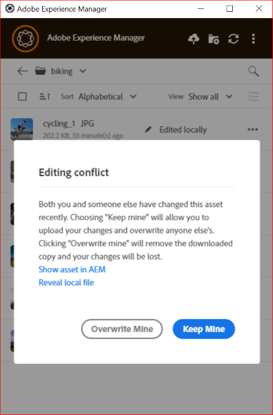

# Usa l&#39;app desktop [!DNL Adobe Experience Manager] {#use-aem-desktop-app-v2}

Utilizzare l&#39;app desktop [!DNL Adobe Experience Manager] per accedere alle risorse digitali archiviate in un archivio DAM [!DNL Adobe Experience Manager] sul desktop locale. Puoi quindi utilizzare queste risorse in qualsiasi applicazione desktop. Puoi aprire e modificare le risorse localmente nelle applicazioni desktop. Dopo aver apportato le modifiche, caricarle di nuovo in [!DNL Experience Manager] con il controllo della versione per condividere gli aggiornamenti con altri utenti. È inoltre possibile caricare nuovi file e gerarchie di cartelle in [!DNL Experience Manager], creare cartelle ed eliminare risorse o cartelle da [!DNL Experience Manager] DAM.

L&#39;integrazione consente a vari ruoli dell&#39;organizzazione di gestire centralmente le risorse in [!DNL Experience Manager Assets] e di accedere alle risorse sul desktop locale nelle applicazioni native su Windows o macOS.

Quando apri l&#39;applicazione dopo la disconnessione o per la prima volta, fornisci l&#39;URL del server [!DNL Experience Manager] nel formato `https://[aem-server-url]:[port]/`. Selezionare quindi l&#39;opzione [!UICONTROL Connect]. Immetti le credenziali per connettere l&#39;app al server.

Le attività chiave eseguite con l&#39;app desktop [!DNL Adobe Experience Manager] sono:

![Flussi di lavoro e attività eseguibili con [!DNL Experience Manager] app desktop](assets/aem_desktop_app_usecases_v2.png "Flussi di lavoro e attività eseguibili con [!DNL Adobe Experience Manager] app desktop")

<!--Download [this](assets/aem_desktop_app_usecases_print.pdf) print-ready PDF file.-->

## Funzionamento dell’app desktop {#how-app-works2}

Prima di iniziare a utilizzare l&#39;applicazione, scopri [come funziona l&#39;app](release-notes.md#how-app-works). Inoltre, acquisisci familiarità con i seguenti termini:

* **[!UICONTROL Desktop Actions]**: dall&#39;interfaccia Web di Assets, dall&#39;interno di un browser, è possibile esplorare i percorsi delle risorse o estrarle e aprire la risorsa per la modifica nell&#39;applicazione desktop nativa. Queste azioni sono disponibili dall’interfaccia web e utilizzano le funzionalità dell’app desktop. Consulta [come abilitare le azioni desktop](using.md#desktopactions-v2).

* Lo stato del file è **[!UICONTROL Cloud Only]**: tali risorse non vengono scaricate nel computer locale e sono disponibili solo nel server [!DNL Experience Manager].

* Lo stato del file è **[!UICONTROL Available locally]**: le risorse vengono scaricate e sono disponibili nel computer locale nello stato corrente. Le risorse non vengono modificate.

* Lo stato del file è **[!UICONTROL Edited locally]**: tali risorse vengono modificate localmente e le modifiche rimangono sul server caricato su [!DNL Experience Manager]. Dopo il caricamento, lo stato cambia in [!UICONTROL Available locally]. Consulta [modificare le risorse](using.md#edit-assets-upload-updated-assets).

* Lo stato del file è **[!UICONTROL Editing conflict]**: se modifichi una risorsa contemporaneamente, l&#39;app indica che si è verificato un conflitto di modifica. L’app fornisce anche opzioni per mantenere o eliminare le modifiche. Consulta [come evitare di modificare i conflitti](using.md#adv-workflow-collaborate-avoid-conflicts).

* Lo stato del file è **[!UICONTROL Modified remotely]**: l&#39;app indica se una risorsa scaricata è stata modificata nel server [!DNL Experience Manager]. L’app offre anche l’opzione di scaricare la versione più recente e aggiornare la copia locale. Consulta [come evitare di modificare i conflitti](using.md#adv-workflow-collaborate-avoid-conflicts).

* **[!UICONTROL Check-out]**: se si sta modificando un file o si intende modificarlo, cambiare lo stato per estrarlo. Aggiunge un&#39;icona di blocco alla risorsa nell&#39;app e nell&#39;interfaccia Web [!DNL Experience Manager]. L’icona Blocca indica ad altri utenti di evitare di modificare contemporaneamente la stessa risorsa poiché si verifica un conflitto di modifica.

* **[!UICONTROL Check-in]**: contrassegna la risorsa come sicura per la modifica da parte di altri utenti senza causare un conflitto di modifica. Quando carichi le modifiche, l’icona del lucchetto viene rimossa automaticamente. L’attivazione dello stato di archiviazione comporta anche la rimozione dell’icona del lucchetto, ma Adobe consiglia di evitare di eseguire manualmente il check-in senza caricare le modifiche. Se si eliminano le modifiche, attivare manualmente il check-in.

* Azione **[!UICONTROL Open]**: è sufficiente aprire la risorsa per visualizzarne l&#39;anteprima nell&#39;applicazione nativa. Adobe consiglia di evitare di modificare la risorsa utilizzando questa azione. Il motivo è che non estrae la risorsa. Nel frattempo, altri utenti possono apportare modifiche che causano conflitti di modifica.

* Azione **[!UICONTROL Open with]**: la funzione &quot;Apri con&quot; consente di aprire un file con un&#39;applicazione specifica diversa da quella predefinita. Questo è utile per scegliere un programma preferito, accedere a file in formati diversi, risolvere problemi con l’app predefinita o lavorare con più programmi. Offre flessibilità consentendo di sostituire temporaneamente l&#39;applicazione predefinita senza modificare le impostazioni in modo permanente.

* Azione **[!UICONTROL Open In Web]**: per visualizzare la risorsa nell&#39;interfaccia Web [!DNL Experience Manager], aprirla nel Web. È possibile avviare altri flussi di lavoro dall&#39;interfaccia [!DNL Experience Manager], ad esempio aggiornando i metadati o individuando le risorse.

* Azione **[!UICONTROL Edit]**: utilizzare l&#39;azione per modificare l&#39;immagine. Facendo clic su [!UICONTROL Edit], la risorsa viene estratta e viene aggiunta un&#39;icona di blocco sulla risorsa. Dopo aver fatto clic su Modifica, se non desideri modificare la risorsa fai clic su [!UICONTROL Toggle check-in]. Per eliminare, rinominare o spostare le risorse nella gerarchia di cartelle DAM [!DNL Experience Manager], utilizzare le azioni dell&#39;interfaccia Web [!DNL Experience Manager] e non l&#39;azione di modifica.

* Azione **[!UICONTROL Download]**: scarica la risorsa nel computer locale. Puoi scaricare le risorse ora e modificarle in un secondo momento; lavorare offline e caricare le modifiche in un secondo momento. Assets viene scaricato in una cartella cache del file system.

* Azione **[!UICONTROL Reveal File]** o **[!UICONTROL Reveal Folder]**: quando le risorse vengono scaricate in una cartella della cache locale, l&#39;app simula un&#39;unità di rete locale. Fornisce un percorso locale per ogni risorsa. Per conoscere questo percorso, utilizza l’opzione di visualizzazione appropriata nell’app. Per inserire risorse nell’applicazione Creative Cloud è necessaria un’azione di visualizzazione. Vedi [posiziona risorse](using.md#place-assets-in-native-documents).

* Azione **[!UICONTROL Delete]**: eliminare la risorsa dall&#39;archivio DAM [!DNL Experience Manager]. L’azione elimina la copia originale della risorsa sul server Experience Manager. Se desideri ignorare solo le modifiche apportate alla risorsa locale, vedi [ignorare le modifiche](using.md#edit-assets-upload-updated-assets).

* **[!UICONTROL Upload Changes]**: l&#39;app desktop carica la risorsa aggiornata solo quando l&#39;utente carica esplicitamente nel server [!DNL Experience Manager]. Quando si salvano le modifiche, queste vengono salvate solo nel computer locale. Quando carichi, la risorsa viene automaticamente archiviata e l’icona del lucchetto rimossa. Consulta [modificare le risorse](using.md#edit-assets-upload-updated-assets).

## Abilita azioni desktop nell&#39;interfaccia Web [!DNL Experience Manager] {#desktopactions-v2}

Dall&#39;interfaccia utente di [!DNL Assets] in un browser, puoi esplorare i percorsi delle risorse o estrarle e aprire la risorsa per la modifica nell&#39;applicazione desktop. Queste opzioni sono denominate [!UICONTROL Desktop Actions] e non sono abilitate per impostazione predefinita. Per abilitarlo, segui la procedura riportata di seguito.

1. Nella console [!DNL Assets] fare clic sull&#39;icona **[!UICONTROL User]** nella barra degli strumenti.
1. Fare clic su **[!UICONTROL My Preferences]** per visualizzare la finestra di dialogo **[!UICONTROL Preferences]**.

1. Nella finestra di dialogo [!UICONTROL User Preferences], seleziona **[!UICONTROL Show Desktop Actions For Assets]**, quindi fai clic su **[!UICONTROL Accept]**.

   

   *Figura: selezionare [!UICONTROL Show Desktop Actions For Assets] per abilitare le azioni desktop.*

## Visualizzare le risorse {#view-assets}

L’app desktop AEM consente di visualizzare le risorse in quattro diverse visualizzazioni:

* **[!UICONTROL Show Assets]:** ti consente di visualizzare tutte le risorse.
* **[!UICONTROL Show Collections]:** consente di visualizzare tutte le raccolte create nell&#39;applicazione nativa AEM. Visualizza altre [raccolte](#collections-desktop-app).
* **[!UICONTROL Edited Locally]:** consente di visualizzare tutte le risorse modificate localmente. In questa vista puoi aggiungere e caricare più risorse.
* **[!UICONTROL Asset transfers]:** ti consente di visualizzare tutte le risorse trasferite dall&#39;app nativa a locale o viceversa.
* **[!UICONTROL Pinned items]:** consente di visualizzare tutti gli elementi bloccati.

Per scegliere tra varie visualizzazioni delle risorse nell’app AEM Desktop, esegui i seguenti passaggi:

1. Apri l’app desktop AEM.

1. Vai al menu a discesa Visualizza in alto a destra. Sceglietene una tra le viste disponibili.

   

### Visualizzare le cartelle e i file appena aggiunti {#view-newly-added-files-folders}

Puoi caricare le nuove risorse create dal computer locale in AEM, dove è memorizzato l’archivio centrale. Per visualizzare localmente le nuove risorse create, passa al menu a discesa **[!UICONTROL View]** e seleziona **[!UICONTROL Show Assets]** per visualizzare tutti gli aggiornamenti con la relativa timeline e i titoli, oppure seleziona **[!UICONTROL Edited Locally]**. Entrambe le opzioni mostrano esplicitamente le risorse modificate localmente.

## Sfogliare, cercare e visualizzare in anteprima le risorse {#browse-search-preview-assets}

È possibile cercare, cercare e visualizzare in anteprima le risorse disponibili nell&#39;archivio [!DNL Experience Manager], il tutto dall&#39;applicazione desktop. Prova quanto segue nell’app:

1. Individua una cartella e visualizza alcune informazioni di base delle risorse disponibili nella cartella, insieme a miniature di piccole dimensioni di tutte le risorse.

   

1. Per visualizzare ulteriori informazioni e una miniatura più grande di una singola risorsa, fai clic sul nome del file.

   

1. Fare clic su **[!UICONTROL Open]** o **[!UICONTROL Edit]** per scaricare il file localmente e visualizzarlo o modificarlo rispettivamente nell&#39;applicazione nativa.
1. Eseguire ricerche utilizzando parole chiave per trovare una risorsa correlata nell&#39;archivio [!DNL Experience Manager]. Utilizzare `?` e `*` come caratteri jolly. Questi caratteri jolly sostituiscono rispettivamente un singolo carattere o più caratteri. Filtra e ordina i risultati in base alle esigenze.

   

   

>[!NOTE]
>
>L’app visualizza le risorse confrontando i criteri di ricerca in più campi di metadati e non solo il titolo della risorsa o il nome del file.

## Gestione delle risorse {#assets-management}

La gestione delle risorse prevede l’organizzazione, la manutenzione e l’ottimizzazione delle risorse digitali per semplificare i flussi di lavoro. Include attività quali la duplicazione e la ridenominazione dei file, il blocco o l’apertura di cartelle per un accesso rapido e la visualizzazione di risorse in vari layout. Ciò consente di migliorare l’efficienza, semplificare il tracciamento delle risorse e garantire un facile recupero e l’organizzazione delle risorse digitali su più piattaforme.

### File duplicati {#duplicate-files}

Se si desidera conservare un file originale e apportare modifiche a un file simile, è possibile duplicare i file in posizioni diverse (locale e cloud) contemporaneamente. Può essere eseguita tramite l’operazione sui file duplicati tra le risorse.

Per duplicare i file nell’app desktop AEM, effettua le seguenti operazioni:

1. Individua una cartella e seleziona la risorsa da duplicare.

   

1. Fai clic su **[!UICONTROL More actions]**  e seleziona  **[!UICONTROL Duplicate File]** azione.

1. Il file duplicato viene creato con un nome e un contenuto identici.

### Rinominare il titolo di una risorsa {#rename-asset-title}

Per rinominare il titolo di una risorsa, esegui i passaggi seguenti:

1. Sfoglia la risorsa da rinominare.

1. Fai clic su **[!UICONTROL More actions]**  e seleziona **[!UICONTROL Rename]** per aggiungere il titolo desiderato per una risorsa.

<!--1. Click **[!UICONTROL More actions]**  and select **[!UICONTROL open in web]** to open the asset in its native application.

1. Go to asset details. Under [!UICONTROL Basic] tab, go to title and enter the text.-->

### Aggiungi o rimuovi puntina sulla cartella {#pin-unpin-folder}

Per l’accesso rapido, puoi fissare o sbloccare una cartella eseguendo i passaggi seguenti:

1. Sfoglia la risorsa da fissare o sbloccare.

1. Fai clic su **[!UICONTROL More actions]**  e seleziona [!UICONTROL pin] per fissare la risorsa o la cartella. In alternativa, fare clic su [!UICONTROL unpin] per sbloccarlo.

   

### Aggiornamento automatico {#auto-refresh}

La funzione di aggiornamento automatico aggiorna automaticamente i contenuti in tempo reale, assicurandoti di visualizzare sempre le informazioni più recenti senza ricaricare manualmente la pagina. Esegui i passaggi seguenti per aggiornare automaticamente le risorse e ottenere l’elenco delle risorse aggiornate:

1. Apri l’app desktop AEM.

1. Fai clic sull&#39;icona  sulla barra dei menu per ottenere gli aggiornamenti.

## Scaricare le risorse {#download-assets}

Puoi scaricare le risorse sul file system locale. L&#39;app recupera le risorse dal server [!DNL Experience Manager] e salva la stessa copia nel file system locale.

Fai clic su **[!UICONTROL More actions]**  per le opzioni e fai clic su  per scaricarle.

>[!NOTE]
>
>Quando si scaricano o si caricano uno o più file di grandi dimensioni, l’applicazione disattiva le azioni su risorse e cartelle. Le azioni sono disponibili al termine del download o del caricamento.

Il download di più risorse può causare prestazioni insoddisfacenti se la coda è di grandi dimensioni o si verificano problemi di rete. Inoltre, quando si scarica una cartella è possibile mettere in coda inconsapevolmente molte risorse da scaricare. Per evitare lunghi tempi di attesa, l’app limita il numero di risorse scaricate contemporaneamente. Per informazioni su come configurarlo, vedere [Impostare le preferenze](install-upgrade.md#set-preferences). Anche al di sotto di questo limite, a volte l’app può cercare una conferma prima di scaricare una cartella apparentemente grande.

Se le cartelle sono selezionate e scaricate, l&#39;applicazione scarica solo le risorse memorizzate direttamente nelle cartelle in [!DNL Experience Manager]. Non scarica automaticamente le risorse dalle sottocartelle.

## Aprire le risorse sul desktop {#openondesktop-v2}

Puoi aprire le risorse remote da visualizzare nell’applicazione nativa. Le risorse vengono scaricate in una cartella locale. Vengono quindi avviati nell’applicazione nativa associata al formato di file. È possibile modificare l&#39;applicazione nativa per aprire tipi di file (estensioni) specifici in Mac o Windows.

Fare clic su **[!UICONTROL Open]** dal menu delle risorse. La risorsa viene scaricata localmente e aperta nell’applicazione nativa. Nella barra di stato, controlla l’avanzamento del download e la velocità di trasferimento delle risorse di grandi dimensioni.

<!-- 
-->

>[!NOTE]
>
>Se le modifiche previste non vengono riportate nell&#39;app, fare clic sull&#39;icona di aggiornamento  oppure fare clic con il pulsante destro del mouse nell&#39;interfaccia dell&#39;app e quindi scegliere **[!UICONTROL Refresh]**. Le azioni non sono disponibili mentre sono in corso download o caricamenti di dimensioni maggiori.

Per aprire la cartella di download locale di una risorsa, fai clic sull&#39;icona , quindi sull&#39;azione  **[!UICONTROL Reveal File]**.

## Raccolte {#collections-desktop-app}

L&#39;app desktop AEM ti consente di [visualizzare](#view-collections-desktop-app), [scaricare](#download-collections-desktop-app) e sfogliare le raccolte create nell&#39;applicazione [!DNL Adobe Experience Manager Assets].

### Visualizza raccolte {#view-collections-desktop-app}

Esegui la procedura seguente per visualizzare le raccolte nell’app desktop:

1. Apri l&#39;app desktop AEM e passa a [visualizza risorse](#view-assets).

1. Selezionare **[!UICONTROL Show Collections]**. Vengono visualizzate le raccolte disponibili nell’applicazione nativa.

   

### Scarica raccolte {#download-collections-desktop-app}

Esegui i seguenti passaggi per scaricare le raccolte nell’app desktop:

1. Segui i passaggi 1 e 2 come mostrato in [visualizza raccolte](#view-collections-desktop-app).

1. Vai a ulteriori azioni  nella raccolta che desideri scaricare.

1. Fare clic su **[!UICONTROL Download]** per scaricare la raccolta specifica.

## Creare una cartella con lo schema metadati {#create-folder-with-metadata-schema}

Utilizzando l’app desktop AEM, puoi assegnare i metadati durante la creazione di una nuova cartella. A questo scopo, esegui i seguenti passaggi:

1. Vai all&#39;icona di creazione della directory . Viene visualizzata la schermata **[!UICONTROL Create Directory]**.

1. Aggiungi i seguenti dettagli:
   * **[!UICONTROL Name]** della cartella.
   * **[!UICONTROL Folder Metadata Schema]** per scegliere la gerarchia dei metadati della cartella o **[!UICONTROL none]** se non si desidera correlare ad essa alcun metadati.

1. Fare clic su **[!UICONTROL OK]** per continuare.

## Utilizzare o inserire risorse in documenti nativi {#place-assets-in-native-documents}

In alcuni casi, ad esempio quando si inserisce una risorsa in un documento nativo, si accede a un file in Esplora risorse o in Mac Finder. Per accedere al percorso del file system del file scaricato localmente, utilizzare l&#39;opzione  **[!UICONTROL Reveal File]**.

Fare clic su **[!UICONTROL Reveal File]** o su **[!UICONTROL Reveal Folder]** in una cartella per aprire Esplora risorse o Mac Finder con il file o la cartella preselezionati nel computer locale. Ad esempio, l&#39;opzione è utile per inserire i file [!DNL Experience Manager] nelle applicazioni native che supportano il posizionamento o il collegamento di file locali. Per informazioni su come inserire file in Adobe InDesign, vedere [Inserimento di elementi grafici](https://helpx.adobe.com/indesign/using/placing-graphics.html).

L&#39;azione **[!UICONTROL Reveal File]** apre una condivisione di rete locale. Vengono visualizzate solo le risorse disponibili localmente. In altre parole, visualizza le risorse che sono state rivelate, scaricate o aperte/modificate utilizzando l’app. La condivisione di rete locale non carica le modifiche in [!DNL Experience Manager]. Per caricare le modifiche, utilizza esplicitamente le azioni **[!UICONTROL Upload Changes]** o **[!UICONTROL Upload]** nell&#39;app.

>[!NOTE]
>
>Per garantire la compatibilità con le versioni precedenti dell&#39;app desktop [!DNL Experience Manager] v1.x, i file visualizzati vengono gestiti da una condivisione di rete locale, esponendo solo i file disponibili in locale. I percorsi desktop dei file rivelati sono gli stessi dei percorsi creati dall’app v1.x.

>[!CAUTION]
>
>Non utilizzare l&#39;opzione **[!UICONTROL Reveal File]** per modificare le risorse nelle applicazioni native. Utilizzare invece le azioni **[!UICONTROL Edit]**. Per ulteriori informazioni, consulta [Flusso di lavoro avanzato: collabora agli stessi file ed evita di modificare i conflitti](#adv-workflow-collaborate-avoid-conflicts).

## Modifica le risorse e carica le risorse aggiornate in [!DNL Experience Manager] {#edit-assets-upload-updated-assets}

Apri le risorse per la modifica quando desideri apportare modifiche e caricare le risorse aggiornate nel server [!DNL Experience Manager]. Per evitare conflitti con le modifiche apportate da altri utenti, utilizza l’app per avviare una sessione di modifica. Prima di iniziare la modifica, accertati che sulla risorsa non sia presente un’icona a forma di lucchetto che indica che un altro utente sta modificando la risorsa.

Per modificare una risorsa, cerca la risorsa o passa alla sua posizione. Fai clic sull&#39;icona  e fai clic su **[!UICONTROL Edit]**.

Utilizza **[!UICONTROL Toggle Check-out]** per bloccare la risorsa per evitare conflitti con le modifiche apportate da altri utenti in entrambe le seguenti situazioni:

* Hai iniziato a modificare una risorsa senza prima estrarla (ad esempio semplicemente aprendola).
* Intendi iniziare presto a modificare una risorsa e non desideri che altri la modifichino.

Dopo aver apportato le modifiche, l&#39;app visualizza lo stato **[!UICONTROL Edited Locally]** per le risorse modificate. Tutte le modifiche salvate nelle risorse sono solo locali finché non carichi le modifiche in [!DNL Experience Manager]. Per caricare una o più risorse una alla volta, fai clic su **[!UICONTROL Upload Changes]** tra le opzioni per una risorsa. Crea una versione della risorsa in [!DNL Experience Manager]. Utilizzando l&#39;interfaccia Web di [!DNL Assets], è possibile visualizzare la cronologia delle risorse nella [visualizzazione Timeline](https://experienceleague.adobe.com/en/docs/experience-manager-65/content/assets/using/activity-stream).

Per le best practice sulla modifica collaborativa, vedere [Flusso di lavoro avanzato: collaborare agli stessi file ed evitare conflitti di modifica](#adv-workflow-collaborate-avoid-conflicts).

Nei casi seguenti, potrebbe essere utile ignorare le modifiche e le modifiche apportate alla risorsa locale. Fai clic su **[!UICONTROL Discard Changes]**.

* Se non si desidera salvare le modifiche localmente in [!DNL Experience Manager].
* Inizia ad apportare modifiche alla risorsa originale dopo aver salvato alcune modifiche.
* Interrompi la modifica della risorsa perché non è più necessaria.

Se necessario, attiva il check-out. La risorsa aggiornata viene rimossa dalla cartella della cache locale e scaricata nuovamente quando la modifichi o la apri.

## Carica e aggiungi nuove risorse in [!DNL Experience Manager] {#upload-and-add-new-assets-to-aem}

Gli utenti possono aggiungere nuove risorse all’archivio DAM. Ad esempio, è possibile essere un fotografo di agenzia o un collaboratore esterno che desidera aggiungere un numero elevato di foto da un servizio fotografico all&#39;archivio [!DNL Experience Manager]. Per aggiungere nuovi contenuti a [!DNL Experience Manager], seleziona l&#39;opzione  nella barra superiore dell&#39;app. Individuare i file di risorse nel file system locale e fare clic su **[!UICONTROL Select]**. In alternativa, per caricare le risorse, trascina i file o le cartelle sull’interfaccia dell’applicazione. In Windows, se trascini le risorse su una cartella all’interno dell’app, le risorse vengono caricate nella cartella. Se il caricamento richiede più tempo, l’app visualizza una barra di avanzamento.

<!-- 
-->

È possibile caricare cartelle o singoli file dal file system locale. La gerarchia di una cartella viene mantenuta al momento del caricamento. Prima di caricare le risorse in blocco, vedi [Caricamenti in blocco](#bulk-upload-assets).

Per visualizzare l&#39;elenco delle risorse trasferite in una determinata sessione, fare clic su **[!UICONTROL View]** > **[!UICONTROL Assets transfers]**. L’elenco ti consente di visualizzare e verificare rapidamente i trasferimenti di file della sessione corrente.

È possibile controllare la concorrenza di caricamento (accelerazione) nell&#39;impostazione **[!UICONTROL Preferences]** > **[!UICONTROL Upload acceleration]**. Una maggiore concorrenza in genere consente caricamenti più veloci, ma può richiedere molte risorse e consumare una maggiore potenza di elaborazione del computer locale. Se il sistema è lento, ritenta il caricamento utilizzando un valore di concorrenza inferiore.

>[!NOTE]
>
>L’elenco dei trasferimenti non è permanente e non è disponibile se esci dall’app e riapri.

<!--### Upload local file to AEM {#upload-local-file-to-aem}-->

### Gestire i caratteri speciali nei nomi delle risorse {#special-characters-in-filename}

Nell’app legacy, i nomi dei nodi creati nell’archivio mantenevano gli spazi e le maiuscole/minuscole dei nomi delle cartelle forniti dall’utente. Affinché l&#39;applicazione corrente emuli le regole di denominazione dei nodi dell&#39;app v1.10, abilita [!UICONTROL Use legacy conventions when creating nodes for assets and folders] in [!UICONTROL Preferences]. Consulta [preferenze app](/help/using/install-upgrade.md#set-preferences). Questa preferenza legacy è disabilitata per impostazione predefinita.

>[!NOTE]
>
>L’app modifica solo i nomi dei nodi nell’archivio utilizzando le seguenti convenzioni di denominazione. L&#39;app mantiene invariato il `Title` della risorsa.

<!-- TBD: Do NOT use this table.

| Where do characters occur | Characters | Legacy preference | Renaming convention | Example |
|---|---|---|---|---|
| In file name extension | `.` | Enabled or disabled | Retained as is | NA |
| File or folder name | `. / : [ ] | *` | Enabled or disabled | Replaced with a `-` (hyphen) | `myimage.jpg` remains as is and `my.image.jpg` changes to `my-image.jpg`. |
| Folder name | `% ; # , + ? ^ { } "` | Disabled | Replaced with a `-` (hyphen) | tbd |
| File name | `% # ? { } &` | Disabled | Replaced with a `-` (hyphen) | tbd |
| File name | Whitespaces | Enabled or disabled | Retained as is | NA |
| Folder name | Whitespaces | Disabled | Replaced with a `-` (hyphen) | tbd |
| File name | Uppercase characters | Disabled | Retained as is | tbd |
| Folder name | Uppercase characters | Disabled | Replaced with a `-` (hyphen) | tbd |
-->

| Caratteri ‡ | Preferenze legacy nell’app | Quando si verifica nei nomi dei file | Nei nomi delle cartelle | Esempio |
|---|---|---|---|---|
| `. / : [ ] \| *` | Abilitato o disabilitato | Sostituito con `-` (trattino). Un `.` (punto) nell&#39;estensione del nome file viene mantenuto invariato. | Sostituito con `-` (trattino). | `myimage.jpg` rimane invariato e `my.image.jpg` diventa `my-image.jpg`. |
| `% ; # , + ? ^ { } "` e spazi vuoti |  disabilitata | Gli spazi vuoti vengono mantenuti | Sostituito con `-` (trattino). | `My Folder.` modifiche apportate a `my-folder-`. |
| `# % { } ? & .` |  disabilitata | Sostituito con `-` (trattino). | NA. | `#My New File.` modifiche apportate a `-My New File-`. |
| Caratteri maiuscoli |  disabilitata | Il rivestimento viene mantenuto inalterato. | È stato modificato in caratteri minuscoli. | `My New Folder` modifiche apportate a `my-new-folder`. |
| Caratteri maiuscoli |  abilitata | Il rivestimento viene mantenuto inalterato. | Il rivestimento viene mantenuto inalterato. | NA. |

‡ L’elenco dei caratteri è un elenco separato da spazi.

<!-- TBD: Check if the following is to be included in the footnote.

Do not use &#92;&#92; in the names of files and &#92;&#116; &#38; in the names of folders. 
-->

<!-- TBD: Securing the below presentation of the same content in a comment.

**File names**

| Characters | Replaced by |
|---|---|
| &#35; &#37; &#123; &#63; &#125; &#38; &#46; &#47; &#58; &#91; &#124; &#93; &#42; | hyphen (-) |
| whitespaces | whitespaces are retained |
| capital case | casing is retained |

>[!CAUTION]
>
>Avoid using &#92;&#92; in file names.

**Folder names**

| Characters | Replaced by |
|---|---|
| Characters | Replaced by |
| &#37; &#59; &#35; &#44; &#43; &#63; &#94; &#123; &#123; &#34; &#46; &#47; &#59; &#91; &#93; &#124; &#42; | hyphen (-) |
| whitespaces | hyphen (-) |
| capital case | lower case |

>[!CAUTION]
>
>Avoid using &#92;&#92; &#92;&#116; &#38; in folder names.

>[!NOTE]
>
>If you enable [!UICONTROL Use legacy conventions when creating nodes for assets and folders] in app [!UICONTROL Preferences], then the app emulates v1.10 app behavior when uploading folders. In v1.10, the node names created in the repository respect spaces and casing of the folder names provided by the user. For more information, see [app Preferences](/help/using/install-upgrade.md#set-preferences).

-->

## Utilizzare più risorse {#work-with-multiple-assets}

Gli utenti possono lavorare e gestire facilmente più risorse tramite azioni quali il caricamento di tutte le modifiche in un’unica operazione o il caricamento di cartelle nidificate con pochi clic.

### Sfogliare cartelle di grandi dimensioni {#browse-large-folders}

Quando lavori con cartelle contenenti molte risorse, scorri per visualizzare altre risorse. Per scorrere utilizzando la tastiera, premi alcune volte la scheda per selezionare la risorsa nella parte superiore. Osserva la risorsa evidenziata per sapere quando è selezionata. A questo punto, utilizza il tasto Freccia giù per spostarti all’interno dell’elenco delle risorse.

### Azioni rapide per le risorse selezionate {#quick-actions-for-selected-assets}

Fai clic sulla miniatura di alcune risorse per selezionarle. Per selezionare tutte le risorse, fai clic sulla casella di controllo nella barra superiore dell’app. Il set di azioni applicabili collettivamente a tutte le risorse selezionate viene visualizzato in una barra degli strumenti nella parte inferiore dell’app.

Le azioni disponibili nella barra degli strumenti nella parte inferiore dipendono dallo stato dei file selezionati. Ad esempio, se selezioni solo **[!UICONTROL Edited Locally]** file, viene visualizzata l&#39;icona **[!UICONTROL Upload Changes]**. Se si seleziona una combinazione di **[!UICONTROL Edited locally]** e **[!UICONTROL Cloud only]**, l&#39;azione **[!UICONTROL Upload Changes]** non è disponibile.

### Trova tutte le immagini modificate {#find-all-edited-images}

L&#39;applicazione fornisce una visualizzazione, denominata **[!UICONTROL Edited locally]**, che consente di accedere rapidamente a tutti i file scaricati localmente (tramite [!UICONTROL Open] o [!UICONTROL Edit] azioni) e modificati. L’app ti consente di selezionare tutte le risorse modificate localmente e di caricare le modifiche in pochi clic. In questa vista vengono visualizzate anche le risorse modificate localmente che presentano un conflitto di modifica.

### Caricare risorse in blocco {#bulk-upload-assets}

Utenti o organizzazioni, come fotografi o agenzie creative, possono creare numerose risorse locali durante attività come servizi fotografici, ritocchi o la selezione da un set più ampio. Queste attività vengono spesso eseguite al di fuori di [!DNL Experience Manager]. Possono caricare queste cartelle locali di grandi dimensioni in [!DNL Assets] direttamente dall&#39;app desktop. Le gerarchie di cartelle vengono mantenute e tutte le sottocartelle nidificate e le risorse incluse vengono caricate. Le risorse caricate sono immediatamente disponibili anche per altri utenti dello stesso server. Assets viene caricato in background, pertanto l’operazione non è associata a una sessione del browser web.

![Carica in blocco più cartelle locali dal desktop in [!DNL Experience Manager]](assets/upload_local_folders_da2.png "Carica in blocco più cartelle locali dal desktop in Experience Manager")

Dopo il caricamento, se le modifiche previste non vengono riportate nell&#39;app, fare clic sull&#39;icona di aggiornamento .

>[!NOTE]
>
>Non utilizzare la funzionalità di caricamento per eseguire la migrazione delle risorse tra due distribuzioni di [!DNL Experience Manager]. Vedi invece la [guida alla migrazione](https://experienceleague.adobe.com/en/docs/experience-manager-65/content/assets/administer/assets-migration-guide).

### Elenco delle risorse trasferite {#list-of-transferred-assets}

Per visualizzare l&#39;elenco delle risorse trasferite in una determinata sessione, consulta [Caricare risorse in [!DNL Experience Manager]](#upload-and-add-new-assets-to-aem).

## Flusso di lavoro avanzato: inizia dall&#39;interfaccia Web [!DNL Assets] {#adv-workflow-start-from-aem-ui}

Se necessario, avvia il flusso di lavoro dall’interfaccia web di Assets. L&#39;app desktop si integra con [!DNL Experience Manager] per assumere il controllo quando richiesto utilizzando le azioni desktop.

Un caso speciale di avvio di un flusso di lavoro dall’interfaccia web è l’individuazione delle risorse. La barra di Omnisearch nell’interfaccia utente di Assets offre un’esperienza di ricerca ricca e avanzata. È possibile individuare prima una risorsa desiderata sul Web e quindi avviare il flusso di lavoro nell&#39;app, utilizzando [!UICONTROL Desktop Actions]. Alcuni casi di esempio includono il filtraggio dei risultati di ricerca tramite facet, l’individuazione di una risorsa specifica concessa in licenza da Adobe Stock o una personalizzazione implementata dall’organizzazione che consente di individuare meglio dall’interfaccia web.

La funzionalità dell’app desktop viene utilizzata quando si tentano le seguenti azioni sull’interfaccia web di Assets:

* I [!UICONTROL Desktop Actions] che consentono [!UICONTROL Open], [!UICONTROL Edit] e [!UICONTROL Reveal]
* [!UICONTROL Upload folder]
* [!UICONTROL Check-out] oppure [!UICONTROL check-in]

Ad esempio, le azioni disponibili nell&#39;interfaccia Web per una risorsa estratta nell&#39;app sono [!UICONTROL Open], [!UICONTROL Reveal] e [!UICONTROL Check in].

![Azioni desktop nell&#39;interfaccia Web [!DNL Experience Manager]](assets/assets_web_actions_da2.png "Azioni desktop nell&#39;interfaccia Web di Experience Manager")

>[!NOTE]
>
>Il browser potrebbe richiedere di consentire l&#39;avvio di [!DNL Adobe Experience Manager] Desktop. Per effettuare il trasferimento ininterrotto dal browser all’app ogni volta, seleziona la casella di controllo appropriata per consentire all’app di funzionare.

Non è possibile trovare le informazioni o il flusso di lavoro seguenti tramite l&#39;interfaccia Web. Utilizza l’app desktop poiché l’interfaccia web non tiene traccia delle modifiche locali e non è a conoscenza di quanto segue:

* I file vengono modificati localmente.
* File con un conflitto di modifica e un modo per risolverlo.
* Carica modifiche locali in [!DNL Experience Manager].
* Vari stati dei file disponibili localmente.

Al contrario, è possibile aprire la risorsa nell&#39;interfaccia Web a partire dall&#39;app desktop utilizzando l&#39;azione **[!UICONTROL Open In Web]**.

## Flusso di lavoro avanzato: collabora agli stessi file ed evita di modificare i conflitti {#adv-workflow-collaborate-avoid-conflicts}

In ambienti collaborativi, più utenti possono lavorare sullo stesso set di risorse che può causare conflitti nel controllo delle versioni. Per evitare conflitti, segui le best practice riportate di seguito.

* Non modificare le risorse facendo clic su [!UICONTROL Open]. Non modificare le risorse scaricate localmente aprendo dalla cartella del file system. Gli altri utenti non sanno che la risorsa è in fase di modifica.
* Per modificare una risorsa, fare sempre clic su [!UICONTROL Edit]. Apre la risorsa nell’applicazione nativa e aggiunge un’icona a forma di lucchetto sulla risorsa, in modo che gli altri utenti sappiano che la risorsa è in fase di modifica.
* Fare clic su [!UICONTROL Toggle Check-in] se si avvia accidentalmente la modifica senza fare clic su [!UICONTROL Edit]. Questa funzionalità aggiunge un’icona a forma di lucchetto alla risorsa. Anche se prevedi di modificare una risorsa in un secondo momento, ma desideri evitare che altre persone la modifichino, fai clic su [!UICONTROL Toggle Check-in] per bloccare la risorsa.
* Prima di modificare una risorsa, accertati che altri utenti non la stiano modificando. Cerca l’icona del lucchetto sulla risorsa.
* Dopo aver completato le modifiche, carica tutte le modifiche e quindi archivia la risorsa.

Se una risorsa scaricata localmente viene aggiornata sul server [!DNL Experience Manager], l&#39;app visualizza uno stato **[!UICONTROL Modified remotely]**. È possibile rimuovere la copia locale o aggiornare la copia locale facendo clic rispettivamente su [!UICONTROL Remove] o [!UICONTROL Update]. I collegamenti nella finestra di dialogo consentono di visualizzare entrambe le versioni della risorsa.

Se una risorsa che stai modificando localmente viene aggiornata anche sul server a tua insaputa, l&#39;app visualizza lo stato **[!UICONTROL Editing Conflict]**. È possibile mantenere un set di modifiche: mantenere gli aggiornamenti (fare clic su **[!UICONTROL Keep Mine]**) ed eliminare le modifiche dell&#39;altro utente oppure rispettare gli aggiornamenti dell&#39;altro utente ed eliminare le proprie (**[!UICONTROL Overwrite Mine]**).

## Flusso di lavoro avanzato: posizionamento e collegamento di risorse nel file InDesign {#adv-workflow-place-assets-indesign}

Quando si utilizza l&#39;app desktop [!DNL Experience Manager] per aprire file con risorse collegate, le risorse vengono prescaricate e visualizzate nelle applicazioni native. Affinché questo flusso di lavoro funzioni, l&#39;applicazione nativa deve supportare il posizionamento di collegamenti alle risorse locali e [!DNL Experience Manager] deve supportare la risoluzione di tali collegamenti nei file binari in riferimenti lato server.

L&#39;app desktop [!DNL Experience Manager] supporta questo flusso di lavoro con alcune applicazioni desktop e formati di file selezionati di Adobe Creative Cloud: Adobe InDesign, Adobe Illustrator e Adobe Photoshop. Il flusso di lavoro consente di lavorare in modo efficiente con i file Creative Cloud supportati. Se l&#39;utente A aggiunge risorse a un file InDesign e lo archivia in [!DNL Experience Manager], l&#39;utente B può visualizzare le risorse nel file anche se non ne fanno parte. Le risorse vengono scaricate localmente sul computer dell’utente B.

>[!NOTE]
>
>L&#39;app desktop può essere mappata su qualsiasi unità di Windows. Tuttavia, per le operazioni regolari, non modificare la lettera di unità predefinita. Se gli utenti della stessa organizzazione utilizzano lettere di unità diverse, non possono visualizzare le risorse inserite da altri. Le risorse inserite non vengono recuperate quando cambia il percorso. Le risorse inserite continuano a rimanere nel file binario (ad esempio, INDD) e non vengono rimosse.

Per conoscere le limitazioni di questo flusso di lavoro, vedere [requisiti di sistema e versioni supportate](release-notes.md).

Per provare questo flusso di lavoro con una risorsa immagine e InDesign, effettua le seguenti operazioni:

1. Mantieni a portata di mano un file INDD con risorse inserite in [!DNL Experience Manager]. Per informazioni su come creare un file INDD di questo tipo, vedere [Inserimento di elementi grafici](https://helpx.adobe.com/indesign/using/placing-graphics.html).
1. Dall&#39;app desktop, **[!UICONTROL Edit]** il file INDD con le risorse inserite in [!DNL Experience Manager].
1. L’app scarica il file InDesign e le risorse collegate. Quando InDesign apre il documento, i collegamenti vengono risolti, le risorse vengono scaricate e le risorse vengono visualizzate nel documento InDesign.
1. Per inserire un nuovo elemento grafico nel file InDesign, utilizza l&#39;azione **[!UICONTROL Reveal File]** sulla risorsa. L’azione scarica la risorsa localmente e apre il percorso della condivisione di rete locale in Esplora risorse o in Mac Finder.
1. Inserisci la risorsa rivelata nel documento di InDesign. In questo modo viene creato un collegamento nel documento.
1. Dopo aver completato le modifiche nel documento di InDesign, salvalo e caricalo su [!DNL Experience Manager] utilizzando l&#39;app desktop.

## Flusso di lavoro avanzato: scarica le risorse localmente {#adv-workflow-download-assets-locally}

L&#39;app scarica frequentemente le risorse dal server [!DNL Experience Manager] al file system locale. I download occupano spazio su disco e larghezza di banda. Conoscere gli scenari può aiutarti a ottimizzare il tempo di attesa per il completamento dei download.

Puoi scaricare le risorse dall’app on-demand. Vedi [Scarica risorse](#download-assets).

Quando si utilizza l&#39;azione [!UICONTROL Open] per aprire una risorsa in un&#39;applicazione desktop nativa, la risorsa viene scaricata localmente se non è già disponibile localmente. Vedi [Apri risorse](#openondesktop-v2).

Quando riveli il percorso di una risorsa o cartella dall’interno dell’app, la risorsa o cartella viene prima scaricata localmente e quindi aperta sul computer nella condivisione di rete locale. Vedi [Apri risorse](#openondesktop-v2).

Quando si utilizza l&#39;azione [!UICONTROL Edit] per modificare una risorsa in un&#39;applicazione desktop nativa, la risorsa viene scaricata localmente se non è già disponibile localmente. Consulta [Modifica risorse e carica risorse aggiornate in [!DNL Experience Manager]](#edit-assets-upload-updated-assets).

Se l&#39;app è installata e autorizzata a, completa le azioni quando utilizzi [!UICONTROL Desktop Actions] dall&#39;interfaccia Web [!DNL Experience Manager]. L’app scarica prima la risorsa e quindi completa l’azione.
