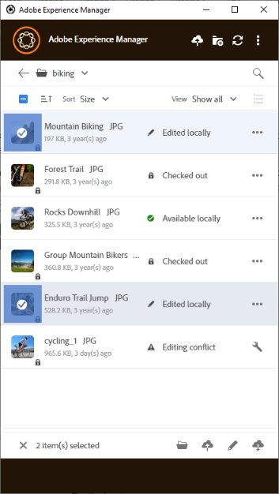

# Utilizzare più risorse {#work-with-multiple-assets}

Gli utenti possono lavorare e gestire facilmente più risorse tramite azioni quali il caricamento di tutte le modifiche in un’unica operazione o il caricamento di cartelle nidificate con pochi clic.

## Sfogliare cartelle di grandi dimensioni {#browse-large-folders}

Quando lavori con cartelle contenenti molte risorse, scorri per visualizzare altre risorse. Per scorrere utilizzando la tastiera, premi alcune volte la scheda per selezionare la risorsa nella parte superiore. Osserva la risorsa evidenziata per sapere quando è selezionata. A questo punto, utilizza il tasto Freccia giù per spostarti all’interno dell’elenco delle risorse.

## Azioni rapide per le risorse selezionate {#quick-actions-for-selected-assets}

Fai clic sulla miniatura di alcune risorse per selezionarle. Per selezionare tutte le risorse, fai clic sulla casella di controllo nella barra superiore dell’app. Il set di azioni applicabili collettivamente a tutte le risorse selezionate viene visualizzato in una barra degli strumenti nella parte inferiore dell’app.

Le azioni disponibili nella barra degli strumenti nella parte inferiore dipendono dallo stato dei file selezionati. Ad esempio, se selezioni solo **[!UICONTROL Edited Locally]** file, viene visualizzata l&#39;icona **[!UICONTROL Upload Changes]**. Se si seleziona una combinazione di **[!UICONTROL Edited locally]** e **[!UICONTROL Cloud only]**, l&#39;azione **[!UICONTROL Upload Changes]** non è disponibile.

## Passaggi successivi {#next-steps}

* [Guarda un video per iniziare a utilizzare l’app desktop Adobe Experience Manager](https://experienceleague.adobe.com/en/docs/experience-manager-learn/assets/creative-workflows/aem-desktop-app)

* Fornisci feedback sulla documentazione utilizzando [!UICONTROL Edit this page]  o [!UICONTROL Log an issue]  disponibile nella barra laterale a destra

* Contatta il [Servizio clienti](https://experienceleague.adobe.com/it?support-solution=General#support)

>[!MORELIKETHIS]
>
>* [Carica risorse](/help/using/upload-assets.md)
>* [Scaricare le risorse](/help/using/download-assets.md)
>* [Ricerca](/help/using/search.md)
